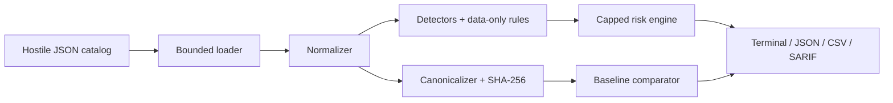

# MCP Tool Security Inspector

> Explainable, deterministic static analysis for Model Context Protocol tool metadata.

[](#ci-use) [](https://www.python.org/) [](LICENSE)

**Security disclaimer:** The MCP Tool Security Inspector is a defensive analysis tool. It identifies indicators that may warrant review but does not establish whether an MCP tool or server is definitively malicious or safe.

## Screenshot placeholders

- `screenshots/clean-scan.png` — clean catalog summary
- `screenshots/suspicious-scan.png` — finding evidence and recommendations
- `screenshots/drift-comparison.png` — baseline drift table

## The problem

AI clients often expose MCP tool names, descriptions, schemas, and metadata to a model. That catalog is a trust boundary: misleading instructions, concealed capabilities, unexpected credential fields, or later schema changes deserve review even when no tool has run. `mcpsec` analyzes that static surface without invoking tools or fetching metadata URLs.

## What are MCP and MCP tools?

[Model Context Protocol](https://modelcontextprotocol.io/) is an open protocol for connecting AI applications to servers that expose context and capabilities. A tool is a named callable capability with descriptive metadata and JSON Schemas for inputs and optional outputs. This release targets the official 2026-07-28 specification and stable official Python SDK v2, while tolerating older common catalog envelopes.

## Threat model and tool poisoning

Tool metadata can influence both human approval and model tool selection. A malicious publisher, compromised server, dependency, or accidental configuration could add model-directed instructions, concealment wording, privileged fields, or obfuscation. See [threat model](docs/threat-model.md) and [tool poisoning](docs/tool-poisoning.md).

## Features

- Single-tool, array, direct `tools` object, and JSON-RPC `tools/list` response loading
- Unknown-field preservation and Unicode NFC normalization
- Stable UTF-8 canonical JSON and SHA-256 full/component fingerprints
- Privacy-conscious baselines and field-level drift classification
- Instruction override, concealment, sensitive data, schema, mismatch, obfuscation, and capability detectors
- Strict data-only YAML rules using safe loading and bounded literal matching
- Explainable, capped risk scores from 0–100
- Rich terminal, JSON, CSV, and SARIF 2.1.0 output
- Evidence redaction and spreadsheet formula-injection mitigation
- CI severity thresholds with documented exit codes
- No telemetry, tool calls, icon downloads, URL fetching, or metadata execution

## Architecture



The implementation never sends catalog content to a model and never executes scanned values. See [architecture](docs/architecture.md).

## Installation

```bash
python -m venv .venv
# Windows: .\.venv\Scripts\Activate.ps1
# Linux/macOS: source .venv/bin/activate
python -m pip install --upgrade pip
python -m pip install -e ".[dev]"
mcpsec --help
```

See [PREPARATION.md](PREPARATION.md) for the audited environment and editor recommendations.

## Quick start and scans

```bash
mcpsec scan examples/clean_tools.json
mcpsec scan examples/suspicious_tools.json
mcpsec scan examples/mixed_tools.json --format json
mcpsec scan examples/suspicious_tools.json --format csv --output report.csv --redact
mcpsec scan examples/suspicious_tools.json --format sarif --output report.sarif
mcpsec scan examples/mixed_tools.json --rules rules/default_rules.yml --fail-on high
```

Structured reports contain no ANSI escape sequences. CSV fields beginning with spreadsheet formula characters are prefixed with an apostrophe.

## Baseline and schema-drift workflow

```bash
mcpsec baseline examples/clean_tools.json --output baseline.json
mcpsec compare examples/clean_tools.json --baseline baseline.json
mcpsec compare examples/changed_tools.json --baseline baseline.json --verbose
mcpsec fingerprint examples/clean_tools.json
```

The changed fixture modifies calculator description and input schema and adds `unit_converter`. Baselines store hashes and structural summaries, not full descriptions, defaults, or example secrets. See [schema drift](docs/schema-drift.md).

## Risk scoring

Each finding's configured contribution is multiplied by confidence. Contributions are grouped and capped at 35 per category; category risks are combined using `100 × (1 − Π(1 − category/100))`. Two documented correlations add bounded synergy: instruction override + concealment adds 10, and concealment + sensitive-data language adds 7. The final value is rounded and capped at 100.

Bands: 0–19 informational, 20–39 low, 40–59 medium, 60–79 high, 80–100 critical. A score prioritizes review; it is not a probability or verdict.

## Rules and explainability

```bash
mcpsec rules list
mcpsec rules validate rules/default_rules.yml
mcpsec explain SEC-001
```

Custom rules allow ID, name, category, fields, literal patterns, severity, confidence, score, recommendation, rationale, benign usage, and enabled state. They cannot contain Python expressions, shell commands, imports, templates, or executable regex. See [detection rules](docs/detection-rules.md).

## Output formats

The terminal table summarizes tool counts, clean/affected totals, severity, risk, rule IDs, evidence, and recommendations. JSON preserves typed findings; CSV is analysis-friendly; SARIF provides GitHub code-scanning-compatible structure for future integration.

## CI use

Exit codes are `0` for no configured threshold exceeded, `1` for a completed scan exceeding `--fail-on`, `2` for invalid user input, and `3` for an internal failure.

```bash
mcpsec scan catalog.json --fail-on medium
```

The included GitHub Actions workflow installs Python, runs Ruff lint/format checks, mypy, and pytest with coverage. It requires no secrets, does not connect to servers, and does not publish.

## Testing

```bash
ruff check .
ruff format --check .
mypy src
python -m pytest --cov=mcpsec --cov-report=term-missing --cov-report=html
```

On Windows, `scripts\test.ps1 -q` runs the correct virtual-environment interpreter even when the environment is not activated. Use `scripts\dev-inspector.ps1` for the local demonstration server; see [the sample-server guide](sample_mcp_server/README.md). The `/sandbox` address printed by Inspector is an internal iframe endpoint, not the main user interface.

Tests cover input shapes, Unicode, canonicalization, hashes, baselines, drift, detectors, risk caps, rule validation, safe YAML, structured reports, CSV neutralization, and CLI exit codes.

## Security model and false positives

All input is untrusted data. Files are size-bounded; strings are length-bounded; YAML uses `safe_load`; schema content is validated but never evaluated; custom matching is literal and bounded; terminal escape bytes are neutralized; reporters do not render HTML. A finding says “suspicious” or “requires review,” never asserts compromise. Every built-in rule documents its rationale, benign triggers, and guidance through `mcpsec explain`.

See [SECURITY.md](SECURITY.md), [detection rules](docs/detection-rules.md), and [limitations](docs/limitations.md).

## Limitations

A clean scan does not establish trust; a suspicious scan does not prove malicious intent. Static metadata may differ from runtime implementation. Heuristics cannot understand every language, business context, schema reference, or prompt-injection variation. Human review and runtime controls remain necessary.

## Roadmap

- v0.2: opt-in, allowlisted local catalog retrieval using SDK `tools/list` only
- Richer MCP 2026-07-28 `x-mcp-header` validation
- Signed baseline envelopes and baseline policy profiles
- Rule-pack versioning, suppressions with justification, and delta SARIF
- Additional language-aware heuristics and corpus-driven false-positive measurement

## Contributing and license

See [CONTRIBUTING.md](CONTRIBUTING.md). Security reports follow [SECURITY.md](SECURITY.md). Licensed under the [MIT License](LICENSE).
