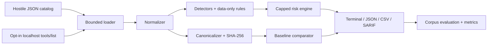

# MCP Tool Security Inspector

> Explainable, deterministic static analysis for Model Context Protocol tool metadata.

[](#ci-use) [](https://www.python.org/) [](LICENSE)
[](https://m8ven.ai/mcp/danveil-mcp-security-inspector-9btdio)

**Security disclaimer:** The MCP Tool Security Inspector is a defensive analysis tool. It identifies indicators that may warrant review but does not establish whether an MCP tool or server is definitively malicious or safe.

## Screenshot placeholders

- `screenshots/clean-scan.png` — clean catalog summary
- `screenshots/suspicious-scan.png` — finding evidence and recommendations
- `screenshots/drift-comparison.png` — baseline drift table

## The problem

AI clients often expose MCP tool names, descriptions, schemas, and metadata to a model. That catalog is a trust boundary: misleading instructions, concealed capabilities, unexpected credential fields, or later schema changes deserve review even when no tool has run. `mcpsec` analyzes that static surface without invoking tools or fetching metadata URLs.

## What are MCP and MCP tools?

[Model Context Protocol](https://modelcontextprotocol.io/) is an open protocol for connecting AI applications to servers that expose context and capabilities. A tool is a named callable capability with descriptive metadata and JSON Schemas for inputs and optional outputs. This release targets the official 2026-07-28 specification and stable official Python SDK v2, while tolerating older common catalog envelopes.

## Threat model and tool poisoning

Tool metadata can influence both human approval and model tool selection. A malicious publisher, compromised server, dependency, or accidental configuration could add model-directed instructions, concealment wording, privileged fields, or obfuscation. See [threat model](docs/threat-model.md) and [tool poisoning](docs/tool-poisoning.md).

## Features

- Single-tool, array, direct `tools` object, and JSON-RPC `tools/list` response loading with duplicate-key and non-finite-number rejection
- Unknown-field/raw-source preservation, icon-text inspection, Unicode NFC normalization, conflicting-alias rejection, and explicit malformed-schema/oversized-text rejection
- Stable UTF-8 canonical JSON and SHA-256 full/component fingerprints
- Privacy-conscious baselines and field-level drift classification
- Instruction override, concealment, sensitive data, schema, mismatch, obfuscation, and capability detectors
- Strict data-only YAML rules using safe loading and bounded literal matching
- Explainable, capped risk scores from 0–100
- Versioned 80-sample synthetic development corpus with integrity hashes, typed provenance, stratified metrics, Wilson intervals, repeated timing, and structured FP/FN evidence
- Evaluation-only detector-family/rule ablations, authoritative JSON run preservation, and compatibility-aware experiment comparison
- Versioned data-only rule packs and justified, scoped suppressions
- Opt-in, localhost-only, bounded MCP SDK `tools/list` retrieval
- Rich terminal, JSON, CSV, and SARIF 2.1.0 output with explicit deterministic finding budgets
- Evidence redaction and spreadsheet formula-injection mitigation
- CI severity thresholds with documented exit codes
- No telemetry, tool calls, icon downloads, metadata URL following, arbitrary command spawning, or metadata execution

## Architecture



The implementation never sends catalog content to a model and never executes scanned values. See [architecture](docs/architecture.md).

## Installation

```bash
python -m venv .venv
# Windows: .\.venv\Scripts\Activate.ps1
# Linux/macOS: source .venv/bin/activate
python -m pip install --upgrade pip
python -m pip install -e ".[dev]"
mcpsec --help
```

See [PREPARATION.md](PREPARATION.md) for the audited environment and editor recommendations.

## Quick start and scans

```bash
mcpsec scan examples/clean_tools.json
mcpsec scan examples/suspicious_tools.json
mcpsec scan examples/mixed_tools.json --format json
mcpsec scan examples/suspicious_tools.json --format csv --output report.csv --redact
mcpsec scan examples/suspicious_tools.json --format sarif --output report.sarif
mcpsec scan examples/mixed_tools.json --rules rules/default_rules.yml --fail-on high
```

Structured reports contain no ANSI escape sequences. CSV fields beginning with spreadsheet formula characters are prefixed with an apostrophe. `--redact` replaces finding evidence excerpts only; copied original tool metadata and the report source are not redacted.

## Baseline and schema-drift workflow

```bash
mcpsec baseline examples/clean_tools.json --output baseline.json
mcpsec compare examples/clean_tools.json --baseline baseline.json
mcpsec compare examples/changed_tools.json --baseline baseline.json --verbose
mcpsec fingerprint examples/clean_tools.json
```

The changed fixture modifies calculator description and input schema and adds `unit_converter`. Baselines store hashes and structural summaries, not full descriptions, defaults, or example secrets. See [schema drift](docs/schema-drift.md).

## Evaluation

```bash
mcpsec evaluate evaluation/corpus/manifest.json
mcpsec evaluate evaluation/corpus/manifest.json --format json --output evaluation-result.json
mcpsec evaluate evaluation/corpus/manifest.json --format csv --output evaluation-samples.csv
mcpsec evaluate evaluation/corpus/manifest.json --timing-warmups 3 --timing-repetitions 10 --runs-dir evaluation/runs
mcpsec evaluate evaluation/corpus/manifest.json --ablation without-injection --runs-dir evaluation/runs
mcpsec evaluate evaluation/corpus/manifest.json --disable-rule SCH-001 --disable-family capability
mcpsec compare-experiments evaluation/runs/EXPERIMENT-A.json evaluation/runs/EXPERIMENT-B.json
# Detector-free integrity check for the preserved, already exposed holdout:
mcpsec corpus-check evaluation/corpus/manifest.json evaluation/holdout/manifest.json
```

The bundled development corpus contains 40 benign and 40 suspicious harmless static definitions, including realistic borderline language. It was visible during detector tuning, so its results are regression evidence rather than independent accuracy. The separate 48-sample holdout 1.0.1 was independently reviewed and evaluated once under the frozen Day 3 H0; it is now exposed and cannot provide confirmatory evidence for modified detectors. Its original artifacts, one malformed-schema disagreement, and subjective difficulty judgments remain preserved. The default experiment applies every built-in rule, no suppressions, a medium binary threshold, one `analysis-core` measurement, and no warm-up. Research runs can repeat measurements on development data, use the broader `static-end-to-end` boundary, disable named detector families or stable rule IDs, and compare preserved JSON artifacts without rescanning. Ablation is confined to evaluation; fingerprints, baselines, drift behavior, thresholds, and risk formulas remain unchanged.

JSON output records an experiment ID, Git state when available, platform/dependency versions, portable invocation, corpus split/version/hash, the exact enabled and disabled detector/family/rule sets, timing definition, complete active configuration and configuration hash, Wilson 95% intervals for accuracy/recall/FPR, per-sample provenance/difficulty/expectations, finding-budget status, stratified raw counts, and mechanically classified failures. It does not record usernames, hostnames, environment-variable values, absolute paths, or Git diffs. `--runs-dir evaluation/runs` preserves an authoritative JSON copy named by experiment ID; generated runs remain untracked unless specifically allowlisted, hashed, and documented as immutable research evidence. `compare-experiments` calculates B−A deltas only when corpus identity, split, samples, ground truth, and threshold are compatible, validates historical artifacts from their recorded identities rather than the current detector registry, and refuses latency deltas when timing boundaries or runtime environments differ.

**Development/regression result on bundled synthetic corpus 1.0.0 after the Day 5B context-scoping correctness fixes — not holdout or real-world detection accuracy:** TP 37, TN 36, FP 4, FN 3; accuracy 91.25%, precision 90.24%, recall 92.50%, F1 91.36%, false-positive rate 10.00%, false-negative rate 7.50%, and specificity 90.00%. This is the unchanged development regression baseline; no rule, threshold, corpus sample, or label was tuned to obtain it.

The `0.3.0a1` prerelease candidate adds `PI-002`, `HID-002`, `SEC-002`, `MIS-002`, and bounded depth-one `OBF-005`. Its separate 36-sample construct-derived exploratory development set currently yields TP 18, TN 18, FP 0, and FN 0. That is intended-mechanism regression evidence only, not a holdout result or a claim of improved generalization.

| Detector evidence | Corpus status | Recall | F1 | FPR |
|---|---|---:|---:|---:|
| v0.2 H0 | Independent first holdout; authoritative confirmatory result | 20.83% | 28.57% | 25.00% |
| v0.3 candidate | Same exposed holdout; post-unblinding exploratory result | 45.83% | 53.66% | 25.00% |

The v0.3 comparison does not independently demonstrate improved generalization. A confirmatory claim requires a new untouched, independently reviewed, preregistered holdout. See the [v0.3 exploratory checkpoint](docs/v0.3-exploratory-checkpoint.md) for frozen identities and limitations.

| Category | Precision | Recall | F1 |
|---|---:|---:|---:|
| capability | 36.36% | 66.67% | 47.06% |
| concealment | 80.00% | 100.00% | 88.89% |
| instruction override | 100.00% | 100.00% | 100.00% |
| mismatch | 70.00% | 100.00% | 82.35% |
| obfuscation | 80.00% | 100.00% | 88.89% |
| schema | 100.00% | 81.82% | 90.00% |
| sensitive data | 58.33% | 100.00% | 73.68% |

See the [research protocol](docs/research-protocol.md), [holdout experiment plan](docs/holdout-experiment-plan.md), [evaluation methodology](docs/evaluation-methodology.md), [experiment-plan template](docs/experiment-plan-template.md), and [false-positive analysis](docs/false-positive-analysis.md). The corpora are versioned separately; label and research-significant metadata changes must be recorded in `evaluation/CHANGELOG.md`.

## Risk scoring

Each finding's configured contribution is multiplied by confidence. Equivalent `(category, rule ID)` contributions are deduplicated using the strongest instance. Contributions are grouped and capped at 35 per category; category risks are combined using `100 × (1 − Π(1 − category/100))`. Two documented correlations add bounded synergy: instruction override + concealment adds 10, and concealment + sensitive-data language adds 7. The final value is rounded and capped at 100. See [risk scoring](docs/risk-scoring.md).

Bands: 0–19 informational, 20–39 low, 40–59 medium, 60–79 high, 80–100 critical. The aggregate risk band is calculated separately from individual finding severity, so one `HIGH` finding can coexist with an informational aggregate band. Classification and `--fail-on` use finding severity, not the aggregate band. A score prioritizes review; it is not a probability or verdict.

## Rules and explainability

```bash
mcpsec rules list
mcpsec rules validate rules/default_rules.yml
mcpsec explain SEC-001
mcpsec scan catalog.json --suppressions rules/suppressions.example.yml
```

Custom rules allow ID, name, category, fields, literal patterns, severity, confidence, score, recommendation, rationale, benign usage, and enabled state. Custom IDs must be unique and cannot collide with built-in IDs. Rule-pack name/version metadata makes experiments reproducible: package `0.3.0a1` currently uses built-in rule pack `2.0.0`; package and rule-pack versions are independent because packaging changes need not alter detection semantics. Separate suppressions require a known rule ID, optional exact tool scope, and written justification. They cannot contain Python expressions, shell commands, imports, templates, or executable regex. See [detection rules](docs/detection-rules.md).

## Opt-in local MCP retrieval

Static files remain the safest default. To retrieve only an explicitly supplied local server's tool catalog:

```bash
mcpsec fetch http://127.0.0.1:8765/mcp --output local-tools.json
mcpsec scan local-tools.json
```

The command uses the official MCP SDK and `tools/list` only. Its dedicated transport revalidates every request as loopback, pins verified `localhost` resolution to the selected loopback IP for the actual connection, preserves HTTPS SNI, rejects redirects, ignores proxy environment variables, and applies a cumulative 10 MiB response budget. It starts no process, invokes no tool, follows no metadata URL, downloads no icon, and also enforces an overall timeout, maximum 500 tools by default, a 100-page limit, schema normalization, oversized-string rejection, and duplicate-name rejection. It uses no inspector-managed authentication. See the [local sample server guide](sample_mcp_server/README.md).

## Output formats

The terminal table summarizes tool counts, clean/affected totals, severity, risk, rule IDs, evidence, and recommendations. JSON preserves typed findings; CSV is analysis-friendly; SARIF provides GitHub code-scanning-compatible structure for future integration.

## CI use

Exit codes are `0` for no configured threshold exceeded, `1` for a completed scan exceeding `--fail-on`, `2` for invalid user input, and `3` for an internal failure.

```bash
mcpsec scan catalog.json --fail-on medium
```

The included GitHub Actions workflow installs Python, runs Ruff lint/format checks, mypy, pytest with coverage, and the offline bundled-corpus evaluation. It retains that JSON evaluation artifact for 14 days. It requires no secrets, does not connect to servers, and does not publish.

## Testing

```bash
ruff check .
ruff format --check .
mypy src
python -m pytest --cov=mcpsec --cov-report=term-missing --cov-report=html
```

On Windows, `scripts\test.ps1 -q` runs the correct virtual-environment interpreter even when the environment is not activated. Use `scripts\dev-inspector.ps1` for the local demonstration server; see [the sample-server guide](sample_mcp_server/README.md). The `/sandbox` address printed by Inspector is an internal iframe endpoint, not the main user interface.

Tests cover input shapes, Unicode, canonicalization, hashes, baselines, drift, detectors, risk caps/deduplication/order invariance, rule packs, suppressions, corpus metadata and hashing, cross-split leakage rejection, reproducibility identity, explicit metric formulas, timing boundaries, ablation selection, Wilson intervals, strata, artifact comparison, structured evaluation, retrieval boundaries, safe YAML, structured reports, CSV neutralization, and CLI exit codes.

## Security model and false positives

All input is untrusted data. JSON duplicate keys, `NaN`, and infinities are rejected. Files, structures, tool counts, findings, retained evidence, pages, YAML aliases/nodes, rule fields, and pattern counts are bounded. Finding output retains at most 64 findings per tool, 2,048 findings per scan or evaluation run, and 8,192 evidence characters per tool; reports expose detected, retained, and truncation status. Strings longer than 100,000 characters are rejected rather than truncated, and a missing, null, or non-object `inputSchema` is rejected instead of silently becoming an empty schema. Conflicting camelCase/snake_case aliases are rejected. YAML uses `SafeLoader`; schema content is validated but never evaluated; custom matching is literal and bounded; terminal escape bytes are neutralized; reporters do not render HTML. A finding says “suspicious” or “requires review,” never asserts compromise. Every built-in rule documents its rationale, benign triggers, and guidance through `mcpsec explain`.

See [SECURITY.md](SECURITY.md), [detection rules](docs/detection-rules.md), and [limitations](docs/limitations.md).

## Limitations

A clean scan does not establish trust; a suspicious scan does not prove malicious intent. Static metadata may differ from runtime implementation. Heuristics cannot understand every language, business context, schema reference, or prompt-injection variation. Human review and runtime controls remain necessary.

## Roadmap

- Confirm the v0.3 detector on a new untouched, independently reviewed, preregistered holdout before making a new confirmatory claim
- Richer MCP 2026-07-28 `x-mcp-header` validation
- Experimental signed baseline envelopes and baseline policy profiles
- Delta SARIF and explicit detection-policy profiles
- Additional language-aware, quotation-aware, and privacy-context heuristics

## Contributing and license

See [CONTRIBUTING.md](CONTRIBUTING.md). Security reports follow [SECURITY.md](SECURITY.md). Licensed under the [MIT License](LICENSE).
