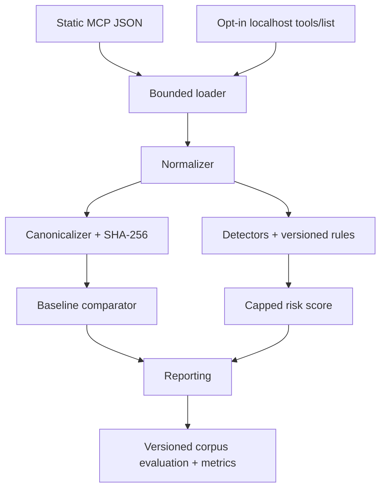

# Architecture

`mcpsec` is a deterministic, offline-first pipeline. `loader` enforces a 10 MiB limit and accepts a raw tool, arrays, `{tools: [...]}`, and JSON-RPC `{result: {tools: [...]}}`. An opt-in retrieval adapter can obtain only `tools/list` from an explicitly supplied localhost Streamable HTTP endpoint and save it as static JSON. `normalizer` maps camelCase and legacy snake_case keys into `ToolDefinition`, NFC-normalizes text, limits individual strings to 100,000 characters, and preserves unknown fields. Duplicate names are rejected because baseline identity would be ambiguous.

`canonicalizer` recursively orders object keys, preserves array order, removes irrelevant whitespace, rejects non-finite numbers, encodes UTF-8 with visible Unicode, and excludes source-path provenance from a tool's full fingerprint. `fingerprint` hashes canonical bytes with SHA-256.

Detectors consume normalized values only. They never mutate a definition. Built-ins use bounded regular expressions with fixed patterns; custom rules use case-insensitive literal containment. Findings feed the duplicate-resistant capped risk engine, then inert reporters. Baselines retain full/component hashes plus field-name summaries, avoiding raw descriptions and schema values. Evaluation uses the same scan engine and compares results with versioned ground truth; it does not maintain a separate detector path.

Trust boundaries are the local input file, optional rule/suppression files, explicit localhost endpoint, terminal, and report consumers. The application does not invoke MCP tools, start supplied commands, follow metadata URLs, download icons, discover credentials, or spawn subprocesses. Retrieval has an overall timeout plus tool-count and serialized-size limits. Static scanning remains the default and initializes no MCP client or network transport.
