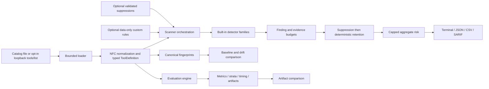
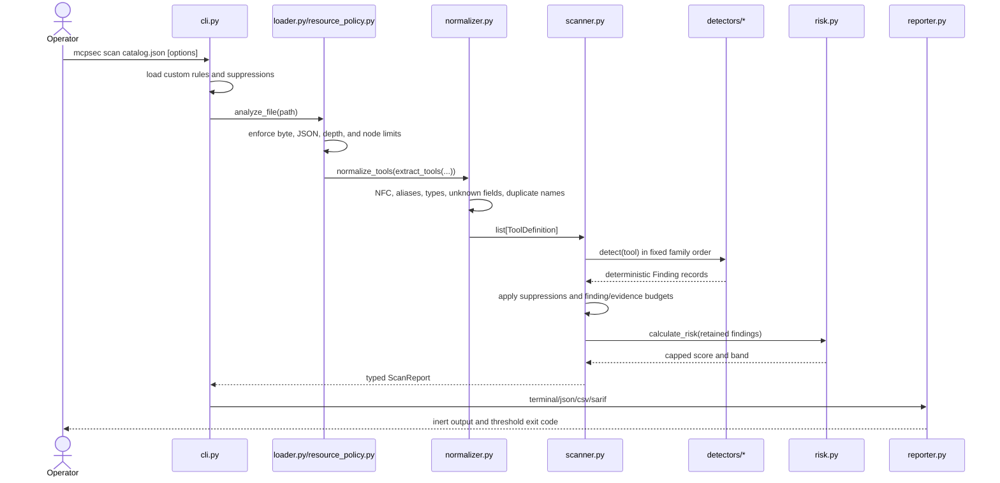

# MCP Tool Security Inspector: Captain's Technical Map

This document is the operator-oriented map of the repository at the Day 6A
checkpoint. It describes the implementation and research evidence as they
exist at Git commit `374471094fd83f4f8b2d4816a7fcb2cdeccbf3ad`. It is a map,
not a new experiment: no detector was run against the exposed holdout while
preparing it.

## 1. Repository identity and purpose

MCP Tool Security Inspector (`mcpsec`) performs deterministic, defensive,
static analysis of MCP `tools/list` metadata. Its security boundary is
deliberately narrow:

- it analyzes tool names, descriptions, schemas, annotations, execution hints,
  icons, metadata, and unknown fields as hostile data;
- it does not invoke a scanned tool, execute metadata, fetch metadata-linked
  resources, start a supplied MCP command, or send catalog content to a model;
- static-file scanning is the default;
- live retrieval is a separate opt-in operation restricted to loopback HTTP(S)
  and `tools/list`;
- findings, risk scores, fingerprints, corpus hashes, and experiment artifacts
  are deterministic except for explicitly recorded timestamps and measured
  latency.

Checkpoint facts:

| Item | Current repository truth |
|---|---|
| Git commit | `374471094fd83f4f8b2d4816a7fcb2cdeccbf3ad` |
| Package version | `0.3.0a1` |
| Built-in rule-pack identity | `builtin` version `2.0.0` |
| Python support | Python 3.12 or newer |
| Primary CLI | `mcpsec` -> `mcpsec.cli:app` |
| Build backend | Hatchling |
| Day 5 hardening commit | `0651313` (`fix: harden v0.3 alpha reproducibility and safety`) |
| Day 5 release-document commit | `3744710` (`docs: prepare v0.3.0a1 alpha release`) |
| Local release evidence at the Day 6G starting checkpoint | Local `main` and the locally stored `origin/main` tracking ref resolved to `374471094fd83f4f8b2d4816a7fcb2cdeccbf3ad`; the local annotated `v0.3.0a1` tag pointed to that commit. The live GitHub release page was not verified. |

## 2. Repository map

```text
mcp-tool-security-inspector/
|-- src/mcpsec/                 Production package
|   |-- detectors/              Built-in detector families and safe representations
|   |-- evaluation/             Corpus, metrics, experiment, ablation, and comparison engine
|   |-- rules/                  Built-in IDs and data-only custom-rule loader
|   |-- cli.py                  Typer command surface and orchestration
|   |-- loader.py               Bounded JSON catalog loading
|   |-- resource_policy.py      Hostile-input limits and strict JSON/YAML primitives
|   |-- normalizer.py           NFC normalization and typed ToolDefinition creation
|   |-- scanner.py              Detector pipeline, suppression, budgets, and risk
|   |-- risk.py                 Deterministic capped aggregate-risk calculation
|   |-- canonicalizer.py        Canonical JSON/value representation
|   |-- fingerprint.py          Tool and component SHA-256 identities
|   |-- baseline.py             Baseline creation/loading
|   |-- compare.py              Drift and conservative rename analysis
|   |-- retrieval.py            Opt-in loopback-only tools/list retrieval
|   |-- reporter.py             Terminal, JSON, CSV, and SARIF output
|   `-- suppressions.py         Data-only suppression validation
|-- tests/                      Unit, security, regression, CLI, and experiment tests
|-- evaluation/
|   |-- corpus/                 80-sample development corpus
|   |-- holdout/                48-sample independently reviewed, now-exposed holdout
|   |-- exploratory/v0_3/       36 post-unblinding construct fixtures
|   `-- runs/                   Selected immutable evidence plus ignored local run output
|-- docs/                       Architecture, threat model, methods, limitations, and releases
|-- examples/                   Inert catalog/configuration examples
|-- rules/                      Example data-only rule pack
|-- sample_mcp_server/          Local demonstration server; not part of static scan execution
|-- scripts/                    Development helper and installed-wheel smoke scripts
|-- .github/workflows/ci.yml    Lint, typing, tests, build, smoke, and development evaluation
|-- pyproject.toml              Packaging, dependencies, CLI, Ruff, mypy, and pytest settings
|-- SECURITY.md                 Security boundary and disclosure information
`-- AGENTS.md                   Maintainer invariants and definition of done
```

The production dependency direction is mostly inward toward small, typed core
modules. The CLI and experiment layer orchestrate; loaders and policies validate;
detectors produce findings; the scanner retains, suppresses, and scores; reporters
serialize. The research corpora and run artifacts are data consumed by the
evaluation layer, not runtime dependencies of a normal static scan.

## 3. Architecture overview



There are three operational lanes:

1. **Static scan:** catalog -> validation -> normalization -> detectors -> risk ->
   inert report. This is the primary product path.
2. **Fingerprint/drift:** normalized tools -> canonical component hashes -> baseline
   or comparison. This detects metadata change without executing tools.
3. **Research evaluation:** typed manifests and static catalogs -> repeated static
   analysis -> effectiveness/timing artifact. This is an offline research path.

## 4. Main static scan flow



Detailed order:

1. `mcpsec.cli:app` dispatches the `scan` command. `python -m mcpsec` reaches
   the same Typer app through `__main__.py`.
2. Optional custom rule and suppression files are loaded with bounded,
   duplicate-key-aware JSON/YAML parsing. Invalid IDs, fields, patterns, or
   suppression scopes fail closed.
3. `scanner.analyze_file()` calls `loader.load_tools()`. The loader reads a
   bounded file, rejects malformed or non-standard JSON constants, extracts a
   tool list, and passes it to the normalizer.
4. `normalizer.normalize_tools()` recursively NFC-normalizes the document,
   detects post-normalization key collisions, validates aliases and schema
   types, preserves unknown fields, and rejects duplicate tool names.
5. `scanner.analyze_tools()` initializes the built-in detectors in a fixed
   order: injection, concealment, sensitive data, schema, mismatch,
   obfuscation, and capability. A custom-rule detector is appended when used.
6. Each detector receives typed inert metadata. Detectors match bounded text;
   none executes a tool or interprets metadata as code.
7. Suppressions are applied after detection. Findings are then retained in a
   deterministic severity-first order under per-tool and report-wide limits.
8. Risk is recalculated from retained findings. The CLI `--fail-on` decision is
   based on individual finding severity, not aggregate risk.
9. A reporter writes literal, bounded output. Terminal control text is escaped,
   and CSV formula-leading cells are neutralized.

## 5. Hostile-input and normalization boundary

The resource policy is a security boundary, not just input convenience.

| Limit | Enforced value |
|---|---:|
| Catalog or baseline bytes | 10 MiB |
| Rule or suppression file bytes | 1 MiB |
| String/key characters | 100,000 |
| General nesting depth | 64 |
| General structural nodes | 100,000 |
| Static catalog tools | 1,000 |
| Custom rules / suppressions | 200 / 500 |
| Patterns per custom rule | 32 |
| Pattern length | 256 characters |
| Findings per tool / report | 64 / 2,048 |
| Retained evidence per tool | 8,192 characters |
| Detector evidence excerpt | 240 characters |
| YAML aliases / nodes / depth | 50 / 10,000 / 64 |

Strict JSON parsing rejects duplicate object keys and `NaN`, `Infinity`, and
`-Infinity`. YAML uses a safe loader plus explicit byte, alias, node, depth,
scalar, and cycle limits. Diagnostic excerpts remain bounded.

Normalization guarantees:

- every string and mapping key is normalized to Unicode NFC;
- two keys that collide after NFC normalization cause rejection;
- `name` is a required, non-empty string;
- `title` and `description` must be strings;
- `inputSchema`/`input_schema` is required, must be an object, and conflicting
  aliases are rejected rather than silently preferred;
- optional `outputSchema`/`output_schema`, annotations, execution data, icons,
  metadata, and top-level source are type checked;
- unknown fields are preserved for analysis instead of discarded;
- provenance such as the local source path is kept separately from the tool's
  canonical content;
- duplicate exact tool names are rejected.

These guarantees prevent ambiguous interpretation between scanners, hashes,
baselines, and evaluation records.

## 6. Detector map

### 6.1 Registry and version boundary

| Family | Rule | Version status | Nominal severity | Detection purpose |
|---|---|---|---|---|
| Injection | `PI-001` | Pre-v0.3 | HIGH | Explicit instruction override or priority manipulation |
| Injection | `PI-002` | New in v0.3 | HIGH | Locally related authority, instruction object, and conflict target |
| Concealment | `HID-001` | Pre-v0.3 | HIGH | Explicit hiding, silence, or non-disclosure language |
| Concealment | `HID-002` | New in v0.3 | HIGH | Omission action related to material operation and observer/visibility |
| Sensitive data | `SEC-001` | Pre-v0.3 | LOW or MEDIUM | Sensitive-data terminology, context-adjusted |
| Sensitive data | `SEC-002` | New in v0.3 | MEDIUM | Action locally related to a sensitive-data term |
| Schema | `SCH-001` | Pre-v0.3 | MEDIUM | Invalid input or output JSON Schema |
| Schema | `SCH-002` | Pre-v0.3 | MEDIUM or HIGH | Privileged terminology in input-schema keys or values |
| Mismatch | `MIS-001` | Pre-v0.3 | HIGH | Undeclared high-impact category in schema versus stated purpose |
| Mismatch | `MIS-002` | New in v0.3 | MEDIUM or HIGH | Structured capability/purpose contradiction with corroboration |
| Obfuscation | `OBF-001` | Pre-v0.3 | MEDIUM or HIGH | Zero-width or bidirectional Unicode controls |
| Obfuscation | `OBF-002` | Pre-v0.3 | LOW | Excessively long description |
| Obfuscation | `OBF-003` | Pre-v0.3 | LOW | Extreme newline or whitespace runs |
| Obfuscation | `OBF-004` | Pre-v0.3 | MEDIUM | Large valid Base64 block in the root description |
| Obfuscation | `OBF-005` | New in v0.3 | INFO on budget issue; MEDIUM on signal | Bounded one-layer representation decoding plus semantic gates |
| Capability | `CAP-001` | Pre-v0.3 | INFO | Disclosed high-impact capability inventory |

The registry order and stable rule IDs are part of deterministic output and
experiment identity. The v0.3 additions are exactly `PI-002`, `HID-002`,
`SEC-002`, `OBF-005`, and `MIS-002`; there is no `CAP-002`.

### 6.2 Shared detector mechanics

`detectors/base.py` supplies bounded text extraction, local context, relation-
scoped negation, educational-reference checks, safe evidence excerpts, and
deterministic finding construction. Poisoning-oriented fields include title,
description, schema values, annotations, execution hints, icons, metadata,
source, and unknown values. Broader safety detectors can use all text fields,
including names and nested keys.

Local-context logic is intentionally conservative. A negation suppresses a
relation only when it is sufficiently close; an educational quotation is not a
finding unless the local text also directs an action. This reduces obvious
false positives without attempting general natural-language understanding.

### 6.3 Family behavior, tests, and residual limitations

| Family | Core behavior | Principal tests | Likely false positives | Likely bypasses / limits |
|---|---|---|---|---|
| Injection | `PI-001` finds explicit override phrases. `PI-002` requires a bounded relationship among an authority/priority term, an instruction object, and a conflict target. | `test_injection_detector.py`, `test_detector_context.py` | Policy documentation, instructional examples, or records that discuss priority and conflict. | Paraphrases outside the fixed lexicon, relations split across distant text/fields, non-English text, or unsupported encodings. |
| Concealment | `HID-001` finds direct secrecy commands. `HID-002` requires omission, a material operation, and an observer/visibility concept in local context. | `test_secrecy_detector.py`, `test_detector_context.py` | Legitimate privacy redaction, UI omission, or non-disclosure documentation. | Indirect observer semantics, distant relationships, novel paraphrases, or encoded text outside supported representations. |
| Sensitive data | `SEC-001` inventories sensitive terms and lowers severity in legitimate/benign contexts. `SEC-002` requires a local action-to-sensitive-term relationship. | `test_sensitive_detector.py` | Credential-management/security tools and policy text; exposed examples `b012` and `b020` show `SEC-002` amplification. | Unlisted synonyms, recovery language, cross-sentence relations, and non-English phrasing. |
| Schema | `SCH-001` validates input/output schema with JSON Schema. `SCH-002` counts distinct privileged terms in the input schema and escalates at three or more. | `test_schema_detector.py` | Legitimate administrative schemas and negated privileged terms. | Valid but dangerous schemas, privileged output-only semantics, and vendor-extension meaning beyond fixed terms. |
| Mismatch | `MIS-001` compares fixed purpose and capability categories. `MIS-002` uses structured capabilities and independent corroboration such as offline contradiction, narrow purpose plus destructive/sensitive behavior, multiple unrelated capabilities, concealment, or destructive action without confirmation. | `test_mismatch_detector.py` | Legitimate multipurpose or administration tools outside known purpose vocabulary. | Novel capability/purpose language and a single uncorroborated capability. |
| Obfuscation | Detects Unicode controls, excessive length/whitespace, root Base64, and bounded decoded HTML numeric/hex/decimal/Base64 representations. `OBF-005` decodes only one layer, then applies fixed semantic signals. | `test_obfuscation.py`, `test_representations.py` | Encoded examples/documentation and legitimate invisible formatting. | Unsupported encoding, content outside size/printability budgets, nested encoding, and decoded semantics outside the fixed gates. It recovered no exposed-holdout cases in Day 4C. |
| Capability | `CAP-001` reports disclosed filesystem, process, network, database, credential, secret-output, or destructive capability at INFO. Structured capability extraction also supports mismatch and obfuscation analysis. | `test_permissions_detector.py` | Legitimate administrative and operations tools. | Indirect or novel capability phrasing. INFO alone is below the preregistered MEDIUM binary threshold. |

The detectors are lexical and structural security review aids, not proof of
malice, intent, exploitability, or runtime behavior. The principal design
tradeoff is deterministic explainability versus semantic coverage.

## 7. Risk and decision semantics

`risk.py` keeps only the strongest contribution per `(category, rule_id)`. Each
contribution is `min(score, 35) * confidence`, each category is capped at 35,
and categories combine as:

```text
100 * (1 - product(1 - category_score / 100))
```

Two fixed synergies are then applied:

- `PI-001` plus `HID-001`: +10;
- `HID-001` plus `SEC-001`: +7.

The result is rounded and capped to 0-100. Risk bands are CRITICAL >= 80,
HIGH >= 60, MEDIUM >= 40, LOW >= 20, otherwise INFO.

This aggregate score is presentation/prioritization metadata. The CLI failure
threshold and evaluation prediction are instead based on whether any retained
finding has severity at or above the configured threshold. Changing one without
understanding the other can silently invalidate research comparability.

## 8. Canonicalization, fingerprints, and hashes

### 8.1 Canonical values

`canonicalizer.py` NFC-normalizes strings, sorts mapping keys by string form,
preserves list order, accepts only finite JSON primitives, and serializes compact
UTF-8 JSON with sorted keys and no `NaN`. `canonical_tool()` excludes internal
provenance and omits a null source to preserve historical canonical behavior.

### 8.2 Tool fingerprints

`fingerprint.py` calculates SHA-256 over UTF-8 canonical text. A tool receives a
full hash plus component hashes for description, input schema, output schema,
annotations, execution, and metadata. The metadata component contains icons,
metadata, unknown fields, and a non-null tool source. Internal file provenance
is excluded.

| Identity | What is hashed | What is excluded | Changes it | Does not change it |
|---|---|---|---|---|
| Full tool fingerprint | Canonical normalized tool content | Internal provenance | Any represented tool-content change | JSON whitespace, object key order, Unicode canonically equivalent spelling |
| Component fingerprint | One semantic component | Other components and provenance | Change to that component | Change confined to another component |
| Baseline identity | Stored tool/component fingerprints and baseline metadata | Runtime tool behavior | Canonical metadata change or baseline metadata change | A tool executing differently with identical advertised metadata |

### 8.3 Corpus hash

`evaluation.integrity.corpus_sha256()` hashes a canonical structure containing a
semantically normalized manifest and the SHA-256 of every referenced catalog's
decoded UTF-8 text. Manifest samples are sorted by ID; category, expected-rule,
and field-location lists are normalized and sorted.

It changes when labels, rationales, provenance, split, paths, membership, or
catalog bytes change. It does not change merely because the manifest JSON is
reformatted or sample/set-like lists are reordered.

Frozen identities:

- development corpus: `a22de0126d2cf0b00c99ded46687b70dc6f417382a0a11c5ae4a9cad8f6d6f47`;
- independent holdout v1.0.1: `c514ba03ac2ca6a6f67ec1e6cc7bb24f0347ccf51a98b0083bdaa53234f5a2d8`.

### 8.4 Experiment configuration hash

`evaluation.research.configuration_sha256()` hashes the semantic evaluation
configuration: threshold, split, enabled/disabled detector/family/rule IDs,
ablation, timing, resolved active-rule semantic digest, suppression identities,
and options. Lists are normalized and sorted.

Raw custom-rule and suppression-file SHA-256 values are recorded separately.
This is intentional: file comments or formatting can change while the active
semantics remain the same. Suppression identity includes rule and tool scope,
but not the human justification text.

The preregistered H0 configuration hash is
`a660fd6dcccf01d691dbfca3683f97aa5f2224cff0f895da602e0c9b2a94f9a1`.
Experiment IDs combine a UTC timestamp with short corpus/configuration hash
prefixes; they identify a run, not a claim of scientific independence.

## 9. Baseline and drift subsystem

`baseline.py` creates format `1.0` baselines containing application version,
timestamp, source, tool fingerprints, and privacy-conscious structural
summaries. Summaries retain fields such as title and schema/property keys, but
avoid copying descriptions, defaults, and examples.

`compare.py` performs drift analysis:

1. map current and baseline tools by exact, case-sensitive name;
2. mark unique additions and removals;
3. infer a rename only when the component signature excluding name/full hash
   uniquely pairs exactly one removed and one added tool;
4. for common names with a changed full hash, report which component hashes
   changed;
5. optionally include structural summary changes in verbose mode.

The conservative rename rule avoids guessing in ambiguous many-to-one cases,
but misses renamed-and-edited tools. Fingerprints detect exact canonical
metadata change, not semantic equivalence, runtime change, or author identity.
A baseline file is not signed and carries no cryptographic trust envelope;
operators must protect its provenance and storage separately.

## 10. Custom rules and suppressions

Custom configuration is data-only.

### Custom rules

- JSON or YAML may contain an optional `rule_pack` identity and a `rules` list;
- legacy files without pack metadata resolve to `legacy-custom` version `0.0.0`;
- rule IDs follow the uppercase stable-ID pattern, must be unique, and cannot
  collide with built-ins;
- at most 200 rules, 32 patterns per rule, 11 supported field roots, and 256
  characters per pattern are allowed;
- matching is case-folded literal substring matching, not user-controlled regex;
- no expression language, import, callback, template execution, or embedded code
  exists;
- the first matching pattern/path creates the deterministic finding.

Supported field roots are name, title, description, input schema, output schema,
annotations, execution, icons, metadata, source, and unknown fields as validated
by the loader's field grammar.

### Suppressions

- a suppression has a known `rule_id`, optional exact tool name, and a required
  10-1000 character justification;
- at most 500 unique `(rule_id, tool)` scopes are accepted;
- a null tool is global; a named tool is an exact scope;
- unknown rule IDs and duplicate scopes fail closed;
- suppressions are applied after detection but before finding retention and risk.

The H0 experiment used no custom rules and no suppressions. This is important:
its primary result tests the frozen built-in detector at MEDIUM without post-hoc
exceptions.

## 11. Reporting and privacy boundary

| Format | Contents and safeguards | Important caveat |
|---|---|---|
| Terminal | Tool/risk summary, finding rule/evidence/recommendation, budget warnings; control characters, ESC, and Rich markup are escaped | Designed for literal display, not a secrecy filter |
| JSON | Complete typed `ScanReport`, normalized tool metadata, findings, risks, source, and budgets | Original metadata remains; `--redact` affects evidence excerpts, not the whole catalog |
| CSV | One row per finding plus clean-tool rows; formula-leading content, tabs, CR, and NUL are neutralized | Spreadsheet import still exposes the exported metadata to the recipient |
| SARIF 2.1 | Rule descriptors, results, source URI, line 1, evidence, and finding-budget state | Generic information URI; source path may reveal local naming |

The tool does not send telemetry or upload reports. Privacy therefore depends on
the operator's chosen input/output paths and handling. Redaction is deliberately
limited and must not be described as full anonymization.

## 12. Opt-in retrieval boundary

`retrieval.py` is isolated from the static scan path. It imports and initializes
the MCP SDK only for the explicit fetch command, calls only `tools/list`, and
writes a static catalog for later inspection. It never invokes a listed tool.

Transport controls include:

- explicit `http` or `https`; no URL credentials, fragments, or port zero;
- host resolution must produce loopback addresses only;
- the connection is pinned to the resolved loopback literal while HTTPS server
  name indication is preserved;
- redirects and environment proxies are disabled;
- cumulative response bytes, pages, cursors, tools, and elapsed time are bounded;
- cursor loops, malformed tools, duplicate names, and limit overruns fail closed.

Defaults include 500 maximum tools and a 10-second timeout; the hard tool ceiling
is 1,000 and the page ceiling is 100. The local sample MCP server is a demo target,
not code the scanner starts or trusts.

## 13. Evaluation engine

### 13.1 Corpus loading and integrity

`evaluation/loader.py` reads a bounded, strict JSON manifest into typed models.
It enforces unique sample IDs, allowed categories, suspicious/benign label rules,
safe relative paths without traversal, cached catalog loading, and selection of
exactly one named tool per sample.

`evaluation/integrity.py` calculates corpus identity and checks cross-split
duplicate IDs and exact canonical/normalized content overlap. It is detector-
free; near-duplicate semantic review remains a documented manual process.

### 13.2 Prediction and repetition

`evaluation/evaluator.py` sorts samples by ID, resolves the detector selection,
then performs configured warm-ups and measured repetitions. A sample is
predicted suspicious when any retained finding severity meets the threshold.
Aggregate risk does not determine the binary label.

Two timing boundaries exist:

- `analysis-core`: normalized sample is loaded before timing; detector/scanner
  work is measured;
- `static-end-to-end`: bounded load, normalization, sample selection, and static
  analysis are measured.

Every repetition must return the same findings/prediction or the run fails. The
engine applies run-level finding limits and recalculates risk when truncation is
necessary.

Each sample record includes expected and predicted labels/categories, expected
and triggered rule IDs/fields, provenance, difficulty, failure type, risk,
findings, budget status, and timing. The run includes corpus/configuration/rule-
pack identity, Git state, application/runtime/platform/dependencies, invocation,
timestamp, aggregate metrics, Wilson uncertainty, strata, and latency summaries.

### 13.3 Metrics

```text
accuracy    = (TP + TN) / total
precision   = TP / (TP + FP)
recall      = TP / (TP + FN)
F1          = 2 * precision * recall / (precision + recall)
FPR         = FP / (FP + TN)
FNR         = FN / (FN + TP)
specificity = TN / (TN + FP)
```

Compatibility helpers return 0.0 for a zero denominator, while stratified and
Wilson records explicitly mark undefined estimates. Wilson 95% intervals are
recorded where preregistered. Timing uses population standard deviation and a
nearest-rank p95; latency remains machine and background-load dependent.

Strata are category, expected field location, difficulty, and ground truth.
Category and field strata overlap. Strata under ten samples are low-evidence
descriptions, not stable population estimates.

Artifact schema `3.1.0` is current; the loader also supports historical `3.0.0`.

## 14. Ablations

`evaluation/ablation.py` defines exactly seven family-removal presets:

- `without-injection`;
- `without-concealment`;
- `without-sensitive-data`;
- `without-schema`;
- `without-mismatch`;
- `without-obfuscation`;
- `without-capability`.

Family, rule, and explicit exclusions are unioned and validated. A fully disabled
family is omitted; a partially disabled detector is wrapped so only allowed rule
IDs remain. Resolved detector, family, and rule identities are recorded and
included in the configuration hash. Ablation is evaluation-only and does not
alter normal scan behavior.

Ablations support within-corpus, paired contribution analysis. They do not prove
universal causal importance, deployment generalization, or the isolated compute
cost of one subrule. The full built-in configuration remains the primary
experiment; family removals are secondary.

## 15. Experiment comparison

`evaluation/comparison.py` strictly loads artifacts up to 20 MiB and accepts
schema versions `3.0.0` and `3.1.0`. It validates sample uniqueness, counts,
labels, predictions, category/risk/failure/timing records, aggregate metrics,
uncertainty, strata, finding budgets, configuration identity, timestamps, and
experiment IDs.

Paired deltas are allowed only when these hard gates match:

- corpus SHA-256;
- split;
- sample population;
- per-sample ground truth;
- decision threshold.

Other differences produce warnings rather than silently blocking valid historical
comparison: non-ablation settings, package/rule-pack versions, full recorded rule
sets, Git commits, and dirty states. Current built-in artifacts must match the
current registry. Historical built-in packs are validated for internal
self-consistency instead of being falsely required to match today's registry.

For compatible artifacts, the comparator reports B-minus-A confusion and metric
deltas, prediction changes, new/resolved false positives and false negatives,
and paired timing only when boundary and exact runtime environment agree.

The corrected current result for H0 versus Day 4C is
`comparable_with_warning`: the corpus and prediction gates match, while the full
rule sets and dirty Day 4 worktree differ. Those warnings are material context,
not a reason to rewrite either artifact.

## 16. Corpus map and permitted use

| Corpus | Frozen identity | Composition | Origin and blindness | Permitted use now | Prohibited claim |
|---|---|---|---|---|---|
| Development | `mcpsec-synthetic-metadata` v1.0.0, SHA-256 `a22de012...d6f47` | 80: 40 benign, 40 suspicious | Synthetic-heavy, single reviewer, visible during tuning | Development, regression, debugging, and declared development evaluation | Independent generalization or unbiased holdout performance |
| Independent holdout | `mcpsec-independent-holdout-metadata` v1.0.1, SHA-256 `c514ba0...a2d8` | 48: 24 benign, 24 suspicious | Independently reviewed and prediction-blind before H0; predictions exposed in Day 3 | Historical H0 preservation, post-unblinding description, comparison, and explicitly exploratory work | A fresh confirmation set for any detector informed by Day 3 results |
| v0.3 exploratory constructs | `mcpsec-v0.3-construct-exploratory-development` v1.0.0 | 36: 18 benign, 18 suspicious | Authored after unblinding from Day 4A target constructs; single reviewer | Mechanism regression and exploratory validation | Independent holdout evidence or proof of deployment generalization |

Development category memberships are injection 8, concealment 8, sensitive data
7, schema 11, capability 6, mismatch 7, and obfuscation 4. Holdout memberships are
3, 4, 4, 4, 6, 4, and 4 respectively. These are overlapping category counts, not
necessarily mutually exclusive sample totals.

The current v0.3 development regression result is TP 37, TN 36, FP 4, FN 3. The
exploratory construct result is TP 18, TN 18, FP 0, FN 0. Both are useful checks,
but neither replaces a fresh independently reviewed holdout.

## 17. Independent human-review record

The holdout review used aliases `R01`-`R48` so the reviewer did not receive the
original IDs, labels, or detector predictions. The reviewer supplied binary
classification, category/field assessments, difficulty, confidence/rationale,
and completed all 48 samples.

| Review fact | Frozen record |
|---|---:|
| Completed | 48 / 48 |
| Reviewer labels | 25 benign / 23 suspicious |
| Agreements / disagreements / abstentions | 47 / 1 / 0 |
| Raw binary agreement | 97.9167% |
| Cohen's kappa | approximately 0.9583 |
| Original ground truth retained | 24 benign / 24 suspicious |
| Exact independent difficulty agreement | 16 / 48 (33.33%) |
| Number of independent reviewers | 1 |

The single disagreement was `R08`, mapped to `holdout_s011` /
`bounded_result_sampler`. The reviewer marked it benign because negative
`maxItems` appeared to be a data-quality defect. Adjudication retained suspicious
under the already frozen malformed-schema security-review construct. That label
means “suspicious under the research construct,” not proof of malicious poisoning.

Original difficulty ratings were not overwritten. High agreement supports
review consistency under this protocol, but one reviewer cannot establish
consensus, construct truth, independence from corpus authorship, or real-world
generalization.

## 18. Day 3 evidence chain

### Day 3A — pre-unblinding audit

Day 3A verified the clean Git checkpoint, independently reviewed holdout,
development/holdout integrity, frozen corpus/configuration hashes, MEDIUM
threshold, full built-in set, no custom rules, no suppressions, timing plan, and
seven ablations. It did not execute the detector on the holdout.

### Day 3B — authoritative H0 evaluation

The first preregistered detector evaluation of the prediction-unexposed reviewed
holdout used the frozen full built-in detector at MEDIUM with no custom rules or
suppressions. Its primary analysis-core configuration used three warm-ups and
ten measured repetitions; the secondary static-end-to-end timing used one and
five.

Authoritative H0 effectiveness:

| TP | TN | FP | FN | Accuracy | Precision | Recall | F1 | FPR |
|---:|---:|---:|---:|---:|---:|---:|---:|---:|
| 5 | 18 | 6 | 19 | 47.92% | 45.45% | 20.83% | 28.57% | 25.00% |

The immutable primary artifact is
`evaluation/runs/exp-20260827T060056391880Z-c514ba03-a660fd6d.json`; its file
SHA-256 is `3307c28daca91132507abad116b771cbc4b505ab8c6e961e6ff33ed436871b80`.
It is authoritative because it is the first and only
preregistered run under the frozen, prediction-unexposed condition—not because
it has favorable metrics.

### Day 3C — post-unblinding failure analysis

Day 3C described all 19 false negatives and six false positives without changing
the detector. Seventeen false negatives had no finding; two had only informational
capability findings. Sensitive-data rules caused four false positives and schema
rules caused two. The analysis recorded hypotheses for later exploratory design.
The tracked report is `evaluation/runs/day3c-deep-failure-analysis.md` with
SHA-256 `deb97ce25609a1d267d8fd00212994c8493f929b6ee31141efcb0b4ff2f9332f`.

### Day 3D — results and discussion evidence pack

Day 3D synthesized tables, claims, limitations, discussion, and viva-ready
evidence from frozen Day 3 artifacts. It did not create another independent
evaluation. Some supporting run material remains intentionally ignored local
evidence rather than tracked source.

After Day 3B, the holdout predictions and failure modes were known. From this
point onward, evaluation of that corpus is necessarily post-unblinding.

## 19. Day 4 exploratory chain

### Day 4A — improvement design

Day 4A used the exposed Day 3 failure analysis to design five bounded,
deterministic candidate rules: `PI-002`, `HID-002`, `SEC-002`, `OBF-005`, and
`MIS-002`. It explicitly kept the MEDIUM threshold, capability rule, risk model,
and old corpus labels fixed.

### Day 4B — v0.3 implementation

Day 4B implemented those rules, shared local-relation/capability/representation
helpers, safety budgets, and benign/suspicious regression cases. It did not
evaluate the old holdout during implementation. The 36 construct fixtures are
post-unblinding development material, not a new holdout.

### Day 4C — exploratory validation

Day 4C evaluated three declared contexts:

- development stayed TP 37, TN 36, FP 4, FN 3;
- v0.3 constructs reached TP 18, TN 18, FP 0, FN 0;
- the exposed holdout changed to TP 11, TN 18, FP 6, FN 13.

Thus six exposed-holdout false negatives became true positives while false
positives stayed at six. `PI-002` and `HID-002` each recovered one case;
`MIS-002` recovered four; `SEC-002` recovered no true positives there and
amplified findings on known benign cases; `OBF-005` recovered none. Thirteen
false negatives still had no findings. These are diagnostic, post-unblinding
observations and cannot confirm generalization.

The tracked exploratory artifact is
`evaluation/runs/day4c/post-unblinding-exploratory-holdout-full-analysis-core.json`
with SHA-256
`d5d84dc33f3ca9091ed02b60d61aca4333206e92d4cecba0488c0f432643806b`.

### Day 4 checkpoint freeze

The candidate was frozen at commit `b1a5d4c` (`feat: freeze v0.3 exploratory
detector candidate`), package `0.3.0a1`, built-in rule-pack version `2.0.0`.
The acceptance is explicitly conditional: confirmation requires a fresh,
untouched, independently reviewed holdout.

## 20. Day 5 adversarial audit and release chain

Day 5A's final adversarial audit identified risks around immutable artifact
preservation, historical artifact compatibility, strict JSON, local context,
metadata/schema validation, resource bounds, rule identities, version identities,
chronology, and duplicate baseline names.

Day 5B remediated those engineering issues and added regression tests without
tuning detector patterns, scores, thresholds, suppressions, or corpus labels.
Notable outcomes include strict duplicate-key/non-standard-number rejection,
safer historical comparison, stronger boundedness, exact artifact checking, and
duplicate baseline-name rejection.

Day 5C independently verified the checkpoint: 472 tests passed, coverage was
92.95%, lint/format/strict mypy/build/fresh installed-wheel smoke passed, and the
verification snapshot was clean. Four additional verification cases covered a
corrupted real H0 artifact, boolean `inputSchema` rejection, scanner finding
budgets, and evaluation budget metadata. Evidence artifacts are marked binary
for Git text/diff treatment through `.gitattributes`.

Day 5D prepared public-alpha documentation, release notes, security/limitations,
reproducibility guidance, and changelog at `3744710`. At the Day 6G starting
checkpoint, local `main`, the locally stored `origin/main` tracking ref, and the
local annotated `v0.3.0a1` tag resolved to that commit. This is local Git
evidence only; it does not establish the current state of the GitHub release
page.

## 21. Module dependency map

“Risk if changed” describes the consequence of a careless modification, not a
ban on maintenance.

| Module/group | Depends on | Principal callers | Responsibility | Risk if changed |
|---|---|---|---|---|
| `__init__.py`, `constants.py` | Package metadata | CLI, research metadata, docs | Version and shared constants | High: identity/artifact drift |
| `__main__.py` | `cli` | Python module entry | `python -m mcpsec` dispatch | Low |
| `exceptions.py` | Standard library | Most validation layers | Stable domain errors | Medium: CLI/error-contract drift |
| `models.py` | Pydantic | Normalizer, scanner, risk, reporter, fingerprints | Core typed tools/findings/reports | Critical: system-wide schema change |
| `resource_policy.py` | JSON/YAML/Pydantic helpers | Catalog, baseline, config, artifact loaders | Hostile-input limits and strict parsing | Critical: denial-of-service or ambiguity |
| `loader.py` | Resource policy, normalizer | Scanner, CLI, evaluation | Bounded catalog extraction | Critical: scan boundary |
| `normalizer.py` | Models, limits | Loader, retrieval, evaluation | NFC, aliases, types, unknown fields | Critical: detector/hash semantic drift |
| `canonicalizer.py` | Normalized values | Fingerprints, integrity, research hash | Stable canonical JSON | Critical: every persisted identity |
| `fingerprint.py` | Canonicalizer, models | Baseline, compare, CLI | Full and component hashes | Critical: drift compatibility |
| `baseline.py` | Loader policy, fingerprints, models | CLI, compare | Create/load baseline format | High: stored compatibility/privacy |
| `compare.py` | Baselines, fingerprints | CLI | Drift and conservative rename inference | High: false drift conclusions |
| `detectors/base.py` | Models, limits | All detector families | Text extraction, context, evidence | Critical: cross-family semantics |
| `detectors/injection.py` | Detector base | Scanner registry | `PI-001`, `PI-002` | Critical: metrics/rule identity |
| `detectors/secrecy.py` | Detector base | Scanner registry | `HID-001`, `HID-002` | Critical: metrics/rule identity |
| `detectors/sensitive_data.py` | Detector base | Scanner registry | `SEC-001`, `SEC-002` | Critical: metrics/false positives |
| `detectors/schema.py` | JSON Schema, detector base | Scanner registry | `SCH-001`, `SCH-002` | Critical: schema/security semantics |
| `detectors/mismatch.py` | Base, structured capabilities | Scanner registry | `MIS-001`, `MIS-002` | Critical: high-impact classifications |
| `detectors/obfuscation.py` | Base, representations | Scanner registry | `OBF-001`-`OBF-005` | Critical: hostile text/budget safety |
| `detectors/representations.py` | Bounded decoding helpers | Obfuscation | One-layer safe representation extraction | Critical: resource or semantic expansion |
| `detectors/permissions.py` | Base patterns | Scanner, mismatch/representation semantics | Capability extraction and `CAP-001` | High: multiple family behavior |
| `detectors/__init__.py` | Detector classes | Scanner, ablation, research identity | Fixed built-in order/registry | Critical: output and config identity |
| `rules/builtin.py` | Detector registry constants | Rules loader, suppression, evaluation | Stable built-in IDs/families | Critical: compatibility |
| `rules/loader.py` | Resource policy, models | CLI, scanner, research config | Data-only custom-rule validation | Critical: untrusted config boundary |
| `suppressions.py` | Resource policy, rule IDs | CLI, scanner, research config | Data-only suppression validation | Critical: hidden finding changes |
| `scanner.py` | Loaders, detectors, rules, suppressions, risk | CLI, evaluator | Pipeline, ordering, budgets, risk | Critical: primary behavior |
| `risk.py` | Findings/models | Scanner, evaluator | Deterministic capped risk | Critical: user/research interpretation |
| `reporter.py` | Rich/JSON/CSV/SARIF, models | CLI | Inert hostile-output rendering | Critical: terminal/spreadsheet safety |
| `retrieval.py` | httpx/MCP SDK, normalizer, limits | Explicit CLI fetch only | Pinned loopback `tools/list` | Critical: network boundary |
| `cli.py` | Most production/evaluation modules | Console entry | Commands, output, exit semantics | High: orchestration and UX |
| `evaluation/models.py` | Pydantic, core models | All evaluation modules | Manifest/config/result/artifact schemas | Critical: evidence compatibility |
| `evaluation/loader.py` | Resource policy, normalizer | Evaluator, integrity | Safe manifest/sample loading | Critical: labels/sample identity |
| `evaluation/integrity.py` | Canonicalizer, loader | CLI/research gates | Corpus hashes and split overlap | Critical: corpus provenance |
| `evaluation/ablation.py` | Detector registry | Evaluator/research config | Seven family-removal configurations | High: contribution claims |
| `evaluation/evaluator.py` | Scanner, loader, ablation, metrics | Evaluation CLI | Repeated deterministic experiment engine | Critical: all effectiveness evidence |
| `evaluation/metrics.py` | Evaluation models | Evaluator, comparison | Confusion and derived metrics | Critical: reported results |
| `evaluation/uncertainty.py` | Math/models | Evaluator/comparison | Wilson intervals | High: uncertainty claims |
| `evaluation/stratification.py` | Metrics/models | Evaluator/comparison | Category/field/difficulty/label strata | High: subgroup claims |
| `evaluation/research.py` | Canonicalizer, environment/Git metadata | Experiment engine/CLI | Config hashes, experiment IDs, reproducibility | Critical: frozen identities |
| `evaluation/comparison.py` | Strict parser, models, metrics | Comparison CLI | Artifact validation and paired deltas | Critical: historical conclusions |
| `evaluation/reporter.py` | Evaluation models | Evaluation CLI | Research table/JSON output | Medium: presentation accuracy |

Tests mirror these boundaries: detector-specific tests cover each family;
`test_resource_policy.py` and `test_strict_json.py` cover hostile parsing;
normalization, fingerprint, baseline, compare, risk, reporting, rules,
suppressions, retrieval, budgets, evaluation, metrics, research, and experiment
tests cover the remaining subsystems.

## 22. Safe extension points

| Goal | Preferred extension point | Required evidence |
|---|---|---|
| Add organization-specific literal policy | Data-only custom rule pack | Loader tests, suspicious case, benign counterexample, bounded config |
| Suppress a reviewed known case | Data-only suppression with exact scope and justification | Document why; record semantic/file identity; never use to improve a frozen result post hoc |
| Add a built-in rule | Existing detector or a bounded new family plus stable ID registry | Suspicious and benign tests, development evaluation, changelog/docs, fresh untouched holdout for confirmation |
| Add a representation decoder | `detectors/representations.py` under current one-layer budgets | Adversarial size/encoding tests and no execution/network/decompression |
| Add a report format | `reporter.py` and CLI option | Hostile terminal/formula/path tests and typed schema documentation |
| Add a corpus | New manifest/catalog directory | Provenance, labels/review protocol, integrity hash, cross-split checks, documented permitted use |
| Add a metric/stratum | Evaluation models, metrics/stratification, artifact schema | Defined zero denominators, tests, schema/version compatibility |
| Add an ablation | Evaluation-only preset and frozen plan | Declare before confirmatory evaluation; preserve full configuration as primary |
| Add retrieval transport | Separate explicit command and hardened policy | Must not weaken loopback/no-redirect/no-proxy/no-invocation boundary |

Extension rule: first decide whether the work is product engineering,
development evaluation, post-unblinding exploration, or confirmatory research.
Name it correctly before changing code or running data.

## 23. Do-not-touch areas without a new protocol

The following items are frozen identities or security boundaries. They can be
changed only with explicit versioning, new tests, regenerated identities, and a
clear statement that old results remain historical.

| Protected area | Why it is sensitive | Minimum action before change |
|---|---|---|
| Holdout files, manifest, labels, review ledger/source | Defines H0 population and independent-review record | Never rewrite H0; create a new corpus/version |
| Authoritative H0 artifact | First preregistered unexposed evaluation | Preserve byte-for-byte; derive new analysis separately |
| Detector regex/patterns and context logic | Directly changes TP/FP/FN behavior | New tests, development results, version/rule identity, post-hoc disclosure |
| Rule IDs/family registry/order | Used by artifacts, suppressions, comparisons, and output order | Compatibility plan and rule-pack version change |
| MEDIUM H0 threshold | Defines binary predictions | Treat alternative threshold as a secondary/new experiment |
| Risk contributions, caps, bands, synergy | Changes operator prioritization and reported risk | Dedicated design/version/migration evidence |
| Canonicalization and fingerprints | Changes baselines, corpus/config hashes, and comparisons | Format/version migration and backward-compatibility tests |
| Resource limits and strict parsing | Prevents ambiguity and resource exhaustion | Security review; never weaken only to make a fixture pass |
| Finding/evidence budgets | Controls safety and result completeness | Adversarial tests and artifact-schema disclosure |
| Loopback retrieval controls | Network and tool-invocation boundary | Threat-model review; no redirects, proxies, or non-loopback expansion by default |
| Historical artifact compatibility logic | Determines whether conclusions may be paired | Corruption tests and explicit schema/version policy |
| Old exposed holdout as validation data | Detector design has already seen its failures | Use only for declared post-unblinding analysis; obtain a fresh holdout for confirmation |

Never “fix” an experiment artifact, label, or hash to make an integrity gate pass.
Find the provenance problem, preserve the evidence, and create a new version when
the underlying object genuinely changes.

## 24. Key operator and maintainer commands

Install and quality gates:

```powershell
python -m pip install -e ".[dev]"
ruff check .
ruff format --check .
mypy src
python -m pytest --cov=mcpsec --cov-report=term-missing
python -m build
python scripts/smoke_wheel.py dist/<wheel-file>.whl
```

Static product operations:

```powershell
mcpsec scan examples/mixed_tools.json
mcpsec scan examples/mixed_tools.json --format json --output scan.json
mcpsec scan examples/mixed_tools.json --fail-on MEDIUM
mcpsec baseline examples/mixed_tools.json --output baseline.json
mcpsec compare examples/mixed_tools.json --baseline baseline.json
```

Use `mcpsec --help` and command-specific `--help` for the authoritative option
surface. For research commands, copy the invocation from the frozen experiment
plan or artifact rather than reconstructing it from memory. Before any
confirmatory run, record a clean Git commit, corpus hash, semantic configuration
hash, exact resolved rule set, runtime metadata, and output destination.

Do not use a broad evaluation command against the old holdout to test a new
detector. That corpus is already exposed. The correct next confirmatory step is
a newly authored, independently reviewed, prediction-blind holdout.

## 25. CI and packaging map

The GitHub Actions workflow runs on Ubuntu/Python 3.12 and performs editable dev
installation, Ruff lint and format check, strict mypy, the coverage-gated test
suite, wheel build and installed-wheel smoke, development-corpus evaluation, and
a clean-policy check. Workflow permissions are read-only and generated test
artifacts are retained for a bounded period.

The wheel explicitly includes the bundled `mcpsec/resources/mixed_tools.json`
example resource; the separate sample server is not forced into the wheel. Runtime
dependencies are the MCP SDK, hardened HTTP client, Typer, Rich, Pydantic,
PyYAML, and JSON Schema. Development dependencies add testing, coverage, lint,
typing, and build tools. Generated virtual environments, build products, and
ordinary run outputs remain untracked; only specifically selected immutable
research evidence is tracked.

## 26. Research validity limits that travel with every result

- The corpora are synthetic-heavy and the original holdout contains no
  real-world samples.
- Fixtures are English-only.
- Suspicious prevalence is 50%, unlike most deployment populations.
- Category and expected-field strata are small and often overlapping.
- Matched construction introduces dependence between samples.
- Provenance and labels may be confounded.
- Description length differs between some benign and suspicious groups.
- Difficulty labels are subjective, with only 16/48 exact independent agreement.
- Only one independent reviewer was used.
- No second independent reviewer audited cross-split near-duplicate leakage.
- Timing is machine and background-load dependent.
- Day 4 changes were designed after seeing Day 3 holdout failures.
- Static metadata cannot establish runtime behavior, malicious intent, or actual
  exploitability.

These are not minor footnotes. They bound the strength of any thesis, release,
or operational claim.

## 27. Captain's decision guide

When investigating a report:

1. Confirm the package, Git commit, rule-pack identity, input/corpus hash, and
   semantic configuration hash.
2. Determine whether the result is product output, development evidence,
   confirmatory H0 evidence, or post-unblinding exploration.
3. Inspect the exact rule ID, field path, evidence budget state, and threshold.
4. Reproduce only on authorized static metadata. Never invoke the listed tool.
5. Add a suspicious regression and a benign counterexample for a detector fix.
6. Evaluate on development material first. Do not reuse the exposed holdout as
   proof of a tuned detector.
7. Preserve old artifacts and hashes; create a new version rather than editing
   research history.
8. Run the full lint, typing, test, build, and installed-wheel gates before a
   release checkpoint.

## 28. Final technical assessment

The repository has a coherent defensive architecture: hostile-input handling is
centralized; normalization and canonicalization make identities reproducible;
detectors are deterministic and bounded; custom configuration remains data-only;
retrieval is opt-in and loopback-only; output hardening treats metadata as
hostile; and the evaluation layer records enough identity to distinguish frozen
H0 evidence from later exploratory work.

The strongest engineering assets are the explicit security invariants, typed
models, strict/bounded loaders, stable rule IDs, component fingerprints,
deterministic repetition checks, historical-artifact validation, and extensive
regression suite. The largest scientific limitation is not missing plumbing: it
is that v0.3 was designed after the original holdout was exposed. Its mechanism
tests and post-unblinding improvements are informative, but the next credible
performance claim requires a fresh independently reviewed holdout whose labels
and detector predictions remain blind until a clean, preregistered run.

Operationally, the captain should preserve the H0 artifact and review record,
keep the v0.3 result explicitly exploratory, verify live remote branch, tag, and
release-page state separately when needed, and resist changing frozen hashes,
thresholds, rules, or labels in place.

NO DETECTOR OR RESEARCH DATA WAS MODIFIED DURING DAY 6A.
