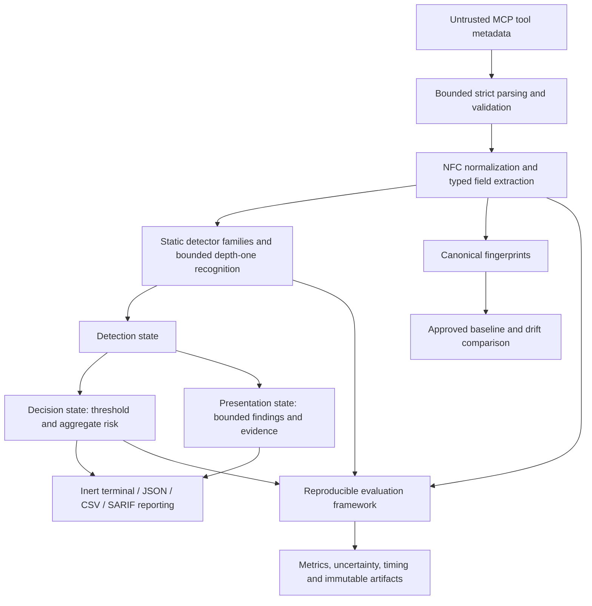

# Formal FYP Proposal Seed Pack

> **Document status:** Academic drafting material derived from the pre-FYP MCP
> Tool Security Inspector prototype. This is not a submitted proposal, an
> approved methodology, a literature review, or evidence that the formal FYP
> has occurred.
>
> **Repository checkpoint:** [REPO-VERIFIED] `HEAD` and `origin/main` were
> `77754aa874722ef0f2d63021279c8f16e0b49a6d` when this seed was created. The
> annotated `v0.3.0a1` tag object was `732f76c381c893942e8ca159b590444c9a6724c8`
> and its historical commit target remained
> `374471094fd83f4f8b2d4816a7fcb2cdeccbf3ad`.

## 1. How to use the evidence labels

- **[REPO-VERIFIED]** — directly supported by current implementation, tests,
  Git state, or frozen repository evidence.
- **[PILOT-EVIDENCE]** — supported by pre-FYP development, H0, review, or
  explicitly exploratory work; not automatically a formal-FYP result.
- **[LITERATURE-REQUIRED]** — requires credible external sources before use as
  an academic factual or gap claim.
- **[SUPERVISOR-DECISION]** — a methodological choice, not an established fact.
- **[UNIVERSITY-REQUIREMENT]** — must be checked against the real FYP handbook,
  template, ethics and submission rules.
- **[FUTURE-RESEARCH]** — proposed work that has not occurred.
- **[DO-NOT-CLAIM]** — unsupported or misleading wording.

## 2. Working title and candidate titles

The documented project/product working name is **MCP Tool Security Inspector**.
It is useful as a repository name but is not yet a formal academic title.

| Candidate title | Precision and alignment | Overclaim risk | Scope implication |
|---|---|---|---|
| **Design and Empirical Evaluation of a Deterministic, Bounded Static Inspector for Predefined Suspicious Constructs in MCP Tool Metadata** | Highest alignment with parsing, normalization, 16 rules, bounds, evaluation and proposal construct refinement | Moderate and controllable; “suspicious constructs” is intent-neutral | One frozen inspector, one approved taxonomy, one future untouched evaluation |
| Static Analysis of Suspicious Metadata Patterns in Model Context Protocol Tool Definitions | Clear and compact; strongly implementation-aligned | Low–moderate | Detector effectiveness is central; drift can remain supporting functionality |
| Detection of Predefined Tool-Poisoning Patterns in MCP Tool Definitions | Clear only if tool poisoning receives a narrow literature-grounded operational definition | High; current schema/security-quality rules are broader than poisoning | May require removing or separating non-poisoning constructs from the primary outcome |
| Integrity Drift and Suspicious-Metadata Analysis for MCP Tool Definitions | Aligns with both detector and baseline/fingerprint subsystems | Low for drift, moderate for suspiciousness | Risks becoming two FYPs unless one capability is secondary |
| A Reproducible Rule-Based Framework for Inspecting MCP Tool Metadata | Highlights engineering and methodology | Low, but may understate the empirical research question | Evaluation framework may become the primary contribution |

**Recommended for supervisor discussion — not final:** [SUPERVISOR-DECISION]
the first candidate. It is precise about observable metadata, bounded static
analysis, and a predefined construct, while avoiding a claim that alerts prove
malicious intent.

## 3. One-sentence definitions

- **For a supervisor:** MCP Tool Security Inspector is a deterministic,
  bounded static-analysis prototype that flags predefined suspicious and
  security-quality constructs in MCP tool metadata, fingerprints definitions
  for drift, and records reproducible evaluation evidence without invoking tools.
- **For a proposal abstract:** This proposed FYP will formalize and evaluate a
  bounded rule-based inspector for predefined suspicious constructs in MCP tool
  definitions using a frozen configuration and a future untouched dataset.
- **For a nontechnical reader:** The system checks an AI tool’s description and
  settings for warning signs and unexpected changes before the tool is used.

## 4. Background of study — evidence skeleton

1. AI agents use external tools to obtain information or perform operations.
   [LITERATURE-REQUIRED — AGENTIC AI AND TOOL USE]
2. MCP defines roles and messages through which hosts/clients discover
   capabilities exposed by servers. [LITERATURE-REQUIRED — OFFICIAL MCP SPEC]
3. An MCP tool definition contains a name, description, input schema and
   optional annotations/vendor metadata that an agent may process before tool
   selection. [LITERATURE-REQUIRED — OFFICIAL MCP TOOL SPEC]
4. Tool metadata can therefore participate in a trust boundary: untrusted text
   may influence model reasoning or conceal a capability. [LITERATURE-REQUIRED —
   AGENT/TOOL TRUST AND MCP SECURITY]
5. Tool poisoning overlaps with indirect prompt injection when instruction-like
   content is embedded in metadata rather than typed directly by the user.
   [LITERATURE-REQUIRED — DEFINITIONS AND RELATIONSHIP]
6. Static inspection can review declared metadata without invoking the tool.
   [REPO-VERIFIED] The current prototype implements this bounded inert boundary.
7. Rule-based inspection offers deterministic, explainable signals but fixed
   rules can miss paraphrases and collide with benign wording. [PILOT-EVIDENCE]
   H0 empirically demonstrated both limitations in this project.
8. Canonical fingerprints and approved baselines can identify declared metadata
   drift, although drift alone does not establish compromise. [REPO-VERIFIED]
9. A formal study needs a frozen construct, independent data, preregistered
   metrics, uncertainty and preserved artifacts rather than development scores
   alone. [PILOT-EVIDENCE] [FUTURE-RESEARCH]

### Exact literature questions

- How do the official MCP specification and security guidance define tool
  discovery, descriptions, schemas, annotations and trust responsibilities?
- How does peer-reviewed literature define prompt injection, indirect prompt
  injection, tool poisoning and agent/tool trust?
- What MCP-specific metadata attacks, incidents, evaluations or defensive tools
  have been documented?
- Which static or rule-based methods have been evaluated for instruction-bearing
  metadata, configuration security or schema misuse?
- What evidence supports or challenges rule-based inspection for adaptive text?
- How are security detectors evaluated under imbalance, small samples and
  adversarial variation?
- How are integrity baselines and configuration drift used without equating
  change with compromise?
- What constitutes a defensible undergraduate design-and-evaluation contribution?

## 5. Four-layer problem context

| Layer | Proposal-ready description |
|---|---|
| **Real-world security problem** | [LITERATURE-REQUIRED] AI agents may consume MCP tool metadata supplied across a trust boundary; misleading, instruction-bearing, concealed or inconsistent metadata may affect safe tool selection and oversight. Prevalence and impact must be established from sources, not assumed. |
| **Research problem** | [SUPERVISOR-DECISION] Determine how effectively a frozen, deterministic static inspector can identify an approved taxonomy of suspicious metadata constructs on previously unseen definitions, with quantified errors and uncertainty. |
| **Engineering problem** | [REPO-VERIFIED] Safely parse hostile metadata, preserve security-significant fields, analyze it without execution, bound resources, separate decision from presentation, fingerprint definitions and render inert reports. |
| **Evaluation problem** | [PILOT-EVIDENCE] High visible-development performance did not transfer to the first independent pilot holdout. A formal study therefore needs untouched data, clear labels, blinded review, frozen settings and honest failure analysis. |

Building a scanner addresses an engineering problem; it does not by itself
answer the research question.

## 6. Candidate problem statements

### A — Conservative

[LITERATURE-REQUIRED] MCP tool definitions may contain security-significant text
and structured metadata that AI systems inspect before tool use. The extent to
which bounded deterministic static analysis can identify predefined suspicious
or security-quality constructs in previously unseen MCP metadata remains a
question requiring literature review and empirical investigation. Without a
clear construct and reproducible evaluation, prototype findings may be mistaken
for evidence of malicious intent or production effectiveness. This motivates a
formal design-and-evaluation study with explicit claim boundaries.

### B — Balanced

[LITERATURE-REQUIRED] Tool-enabled AI systems depend on metadata to describe
available capabilities, creating a potential trust boundary for misleading
instructions, concealed behavior and purpose/capability inconsistencies.
[PILOT-EVIDENCE] A bounded rule-based prototype was feasible, but its first
independent pilot evaluation showed low recall and material false positives.
It is therefore unclear whether a remediated, frozen inspector can detect a
supervisor-approved construct taxonomy on untouched data while maintaining an
acceptable false-positive rate and bounded latency. A formal study is needed to
measure this rather than infer it from development performance.

### C — Tool-poisoning-specific

[LITERATURE-REQUIRED] If MCP tool poisoning is defined as manipulative metadata
intended to influence an agent beyond an honest declared purpose, detection may
require distinguishing instruction-like or concealed relations from legitimate
administrative descriptions. Current static indicators observe representations,
not attacker intent or successful downstream influence. The effectiveness and
limitations of detecting a narrowly predefined subset of such patterns therefore
require investigation using frozen rules and independent evaluation data.

**Recommendation:** Candidate B for literature and supervisor refinement. It
connects the observed pilot problem to a measurable future study without
asserting an unverified universal gap. Sentences about MCP adoption, risk,
existing defenses, prevalence and research scarcity all require literature.

## 7. Candidate research-gap register

| Candidate gap—not a novelty claim | Why it may matter | Current support | Literature needed | Risk if claimed now |
|---|---|---|---|---|
| Lightweight static inspection of MCP tool metadata | Pre-use review could complement runtime controls | Implemented prototype and local pilot timing | MCP defenses and comparable tools | Existing systems may already do this |
| Detection of predefined poisoning-like relations | Context may matter beyond keywords | H0 failure analysis and v0.3 hypotheses | Tool poisoning/indirect injection taxonomies | Project-defined patterns may be circular |
| Metadata-focused security-quality inspection | Schema, sensitive-data and mismatch warnings are review-relevant | 16 rules and tests | Schema/security scanning literature | “Security quality” may be too broad |
| Reproducible MCP detector evaluation | Frozen identities and artifacts reduce hidden degrees of freedom | Repository evaluation framework | Security-detector methodology and MCP datasets | Engineering rigor alone may not be novel |
| Integration of suspicious-pattern and drift analysis | Content and change provide complementary review views | Detector plus baseline/fingerprint implementation | Integrity/configuration drift research | Combined scope may be two studies |

Until literature is complete, use **candidate gap** and **candidate
contribution**, never “no prior work” or “novel.”

## 8. Candidate research questions

| RQ | Candidate question | Variables, controls and evidence | Main threats / decision |
|---|---|---|---|
| **RQ1 — recommended primary** | [SUPERVISOR-DECISION] To what extent can a frozen deterministic, bounded rule-based inspector identify a supervisor-approved taxonomy of suspicious constructs in previously unseen MCP tool metadata? | IV: frozen detector/configuration. DVs: recall and FPR primarily; confusion matrix, precision/F1/CIs secondarily. Controls: threshold, data, runtime and one-run protocol. Needs fresh untouched reviewed data. | Construct ambiguity, synthetic realism, prevalence, reviewer count, adaptive paraphrases; choose primary metrics and acceptable operating criteria. |
| RQ2 | How does the frozen formal candidate compare with the historical v0.2 detector on the same future untouched sample population? | IV: recorded detector version; paired predictions. DVs: outcome changes and metric deltas. | Fair historical reconstruction, paired dependence, multiplicity; decide whether this comparison is primary or secondary. |
| RQ3 | How robust is the frozen inspector to bounded representation and surface variations defined before evaluation? | IV: approved transformations such as whitespace, Unicode, encoding, field relocation. DVs: detection consistency/recall and FP changes. | Transformation realism and leakage; keep development robustness separate from untouched confirmation. |
| RQ4 | What metadata changes can canonical fingerprints and baseline comparison identify deterministically? | IV: controlled change type. DVs: component drift/rename result and invariants. | Drift is not maliciousness; decide whether integrity is core or supporting. |
| RQ5 | What analysis-core and static-end-to-end latency does the frozen inspector exhibit under a controlled local protocol? | IV: boundary/input condition. DVs: median, mean, p95, throughput. Controls: machine/runtime/load/warm-ups/repetitions. | Machine dependence and correlated repeats; secondary engineering question. |

## 9. Candidate objective set

**General objective — [SUPERVISOR-DECISION]:** To design, implement and
empirically evaluate a deterministic, bounded static inspector for a predefined
taxonomy of suspicious and security-quality constructs in MCP tool metadata,
without presupposing detector effectiveness.

| Specific objective | RQ | Candidate method | Deliverable | Metric/evidence |
|---|---|---|---|---|
| O1. Define and justify the target construct, threat model and claim boundary. | RQ1 | Literature synthesis plus supervisor-approved operational taxonomy | Construct rubric and threat model | Traceable definitions, inclusion/exclusion decisions |
| O2. Formalize and remediate the prototype architecture before freeze, including decision/presentation separation. | RQ1/RQ5 | Small versioned engineering changes using development-only tests | Frozen formal candidate | Quality gates and budget-invariance tests |
| O3. Implement/retain deterministic metadata analysis, bounded decoding, fingerprinting and inert reporting according to the approved scope. | RQ1/RQ3/RQ4 | Rule-based static implementation and security-boundary tests | Versioned inspector and rule pack | Rule/test coverage, invariant evidence |
| O4. Design and freeze a reproducible evaluation protocol and independently reviewed untouched dataset. | RQ1/RQ2 | Blinded review, adjudication, hashing and preregistration | Frozen corpus/configuration/protocol | Review record, hashes, preregistration |
| O5. Evaluate effectiveness, uncertainty, failure modes and bounded latency once under the frozen protocol. | RQ1/RQ2/RQ5 | One primary run followed by preregistered analysis | Raw artifact and results chapter evidence | Confusion metrics, CIs, latency, failure taxonomy |

## 10. Scope

### In scope — provisional

- MCP tool definitions and their names, descriptions, JSON schemas,
  annotations, execution/vendor metadata, icons and `_meta` fields.
- Offline/static inspection of predefined suspicious constructs.
- Instruction-priority, concealment, sensitive-data handling, schema,
  purpose/capability mismatch, obfuscation and capability signals.
- Strict parsing, normalization and bounded depth-one representation recognition.
- Canonical fingerprints, approved baselines and metadata drift.
- Terminal/JSON/CSV/SARIF reporting and offline evaluation.
- A future frozen, supervisor-approved formal candidate and untouched evaluation.

### Out of scope — provisional

- Proving attacker intent, server maliciousness or actual downstream compromise.
- Arbitrary tool execution, malware detonation, sandboxing or endpoint security.
- MCP authentication/authorization design, malicious registration prevention,
  full gateways or remote network crawling.
- General prevention of prompt injection or all LLM/agent safety failures.
- Runtime behavior verification, dynamic taint analysis or production SOC claims.
- Recursive decoding, arbitrary decompression, metadata-linked downloads, or
  model-based classification unless the approved research question changes.

## 11. Provisional terminology

| Term | Project operational definition | Literature definition still required? |
|---|---|---|
| MCP | Protocol context in which hosts/clients discover server capabilities | Yes—official specification |
| MCP tool | Named operation advertised through a tool definition | Yes—official specification |
| Tool metadata | Static descriptive/structured fields analyzed by this project | Yes—map to official field semantics |
| Tool poisoning | Narrow motivating class of manipulative metadata; not synonymous with every finding | Yes—critical construct definition |
| Prompt injection | Instruction content intended to alter model behavior | Yes |
| Indirect prompt injection | Such content arriving through an external data/tool context rather than direct user prompt | Yes |
| Suspicious metadata | Metadata matching the frozen operational review taxonomy; not proof of malice | Supervisor approval required |
| Static analysis | Inspection of representation without invoking the advertised operation | Yes for academic positioning |
| Rule-based detection | Deterministic matching/validation/relations defined in versioned code/data | Yes for method comparison |
| Baseline | Approved record of tool/component fingerprints and privacy-conscious structural summary | Useful project definition; literature for integrity framing |
| Drift | Difference between current and baseline-selected metadata identity | Yes; drift does not imply compromise |
| Fingerprint | SHA-256 of a selected canonical tool/component representation | Cryptographic/integrity literature required |
| False positive | Benign-labeled sample predicted suspicious at the frozen threshold | Standard metric citation needed |
| False negative | Suspicious-labeled sample predicted benign at the frozen threshold | Standard metric citation needed |

## 12. Proposed system overview

### Currently implemented foundation [REPO-VERIFIED]

Static JSON passes bounded strict parsing, structure validation, NFC
normalization and alias checks. Typed tool definitions are traversed by seven
detector families containing 16 stable rule IDs. Explicit representations may
be decoded once under fixed size/count/printability limits. Findings can be
suppressed, deterministically retained, aggregated into risk, and rendered to
terminal, JSON, CSV or SARIF with output-safety controls. Canonical SHA-256
fingerprints support baselines and drift. An evaluation package records corpus,
configuration, Git/runtime, timing, metrics, uncertainty and artifact identity.

### Formal-FYP candidate after remediation [FUTURE-RESEARCH]

Before detector freeze, decision state must be independent of presentation
retention. The construct/threat model, threshold, rule set, configuration,
version, comparison and data protocol must then be supervisor-approved and
frozen. Only development data may inform refinement; a new untouched evaluation
must follow preregistration.

## 13. Proposal-ready architecture

This is the **proposed formalized FYP architecture derived from the existing
prototype**. The three-state separation is not yet implemented.

## 14. Current detector taxonomy

| Family / rules | Concept-level role | Provisional construct class |
|---|---|---|
| Injection — PI-001, PI-002 | Explicit override wording and contextual metadata-authority claims | **Core possible FYP target** |
| Concealment — HID-001, HID-002 | Explicit concealment and withholding material activity from visibility | **Core possible FYP target** |
| Sensitive data — SEC-001, SEC-002 | Sensitive terminology and active secret-value handling | SEC-002 core/supporting; SEC-001 supporting signal |
| Schema — SCH-001, SCH-002 | Invalid schemas and privileged input parameters | **Security-quality check / supporting signal** |
| Mismatch — MIS-001, MIS-002 | Undeclared schema capability and corroborated purpose/capability contradiction | **Core possible FYP target** |
| Obfuscation — OBF-001–OBF-005 | Invisible text, reviewability anomalies, opaque Base64 and bounded decoded high-risk text | OBF-005/core representation signal; others supporting/security-quality |
| Capability — CAP-001 | Inventory of potentially high-impact declared operations | **Supporting signal**, deliberately informational |

Every class is provisional [SUPERVISOR-DECISION]. A rule finding indicates a
review construct, not malicious intent, successful poisoning or runtime behavior.

## 15. Known P0 engineering issue

[REPO-VERIFIED] The current scanner computes risk, CLI `--fail-on`, affected
counts and evaluation predictions from **retained findings**. Once a per-tool,
evidence or global report budget is exhausted, presentation truncation can
therefore change decision semantics for later findings/tools. This is an
implementation defect, not only a limitation.

[PILOT-EVIDENCE] The preserved H0 and v0.3 artifacts were audited and contain no
truncated samples, so this defect did not alter those historical results.
[FUTURE-RESEARCH] The formal candidate must separate detection, decision and
presentation state and pass budget-invariance tests before detector/configuration
freeze. This seed pack does not implement the fix.

## 16. Pilot study evidence

### Development/regression result

**[PILOT-EVIDENCE — DEVELOPMENT PERFORMANCE, NOT INDEPENDENT GENERALIZATION]**

| N | Benign | Suspicious | TP | TN | FP | FN | Accuracy | Precision | Recall | F1 | FPR |
|---:|---:|---:|---:|---:|---:|---:|---:|---:|---:|---:|---:|
| 80 | 40 | 40 | 37 | 36 | 4 | 3 | 91.25% | 90.24% | 92.50% | 91.36% | 10.00% |

The corpus was visible during rule work. These values are regression evidence
for the current implementation, not an estimate of unseen or real-world accuracy.

### Authoritative v0.2 H0

**[PILOT-EVIDENCE — AUTHORITATIVE FIRST CONFIRMATORY PILOT RESULT]**

| N | TP | TN | FP | FN | Accuracy | Precision | Recall | F1 | FPR |
|---:|---:|---:|---:|---:|---:|---:|---:|---:|---:|
| 48 | 5 | 18 | 6 | 19 | 47.92% | 45.45% | 20.83% | 28.57% | 25.00% |

Artifact: `evaluation/runs/exp-20260827T060056391880Z-c514ba03-a660fd6d.json`  
SHA-256: `3307c28daca91132507abad116b771cbc4b505ab8c6e961e6ff33ed436871b80`

H0 remains scientifically important because it was frozen and run before its
predictions informed detector changes. Its poor effectiveness limits claims and
shows weak transfer from visible development fixtures to independently authored
pilot constructs. The response was preserved failure analysis, not retrospective
replacement, relabeling or threshold selection.

### Post-unblinding failure analysis

**[PILOT-EVIDENCE — FORENSIC/EXPLORATORY INTERPRETATION]**

- 19 false negatives occurred.
- 17/19 produced no finding and risk zero.
- 2/19 produced only `CAP-001` at INFORMATIONAL, risk 2, below MEDIUM.
- The largest primary miss mechanism was the obfuscation/decoding gap: 4/19.
- Six false positives occurred: `SEC-001` caused four and `SCH-002` caused two.

These observations suggested inadequate semantic/paraphrase coverage, missing
bounded representation recognition, insufficient cross-field relations and
benign-context handling. They also showed that threshold reduction alone could
not recover the 17 samples with no finding. Because this analysis followed H0
unblinding, hypotheses derived from it are exploratory until tested afresh.

### Human review

**[PILOT-EVIDENCE]** The 48 samples received one complete independent review
before detector unblinding: 47 agreements, one disagreement, zero abstentions,
97.9167% raw binary agreement and Cohen’s κ≈0.9583. Exact difficulty agreement
was only 16/48. The single disagreement was R08 / `holdout_s011` /
`bounded_result_sampler`: the original label remained suspicious under the
frozen malformed-schema security-review construct, while the reviewer’s benign
data-quality interpretation was preserved.

This supports high binary agreement with one blinded reviewer under the pilot
rubric. It does not establish ground-truth truth, malicious intent, detector
performance, multi-expert consensus or external validity. Difficulty was much
less stable, and one-reviewer/design-author biases remain.

### v0.3 exposed-holdout result

**[PILOT-EVIDENCE — POST-UNBLINDING EXPLORATORY ONLY]**

| N | TP | TN | FP | FN | Accuracy | Precision | Recall | F1 | FPR |
|---:|---:|---:|---:|---:|---:|---:|---:|---:|---:|
| 48 | 11 | 18 | 6 | 13 | 60.42% | 64.71% | 45.83% | 53.66% | 25.00% |

Artifact: `evaluation/runs/day4c/post-unblinding-exploratory-holdout-full-analysis-core.json`  
SHA-256: `d5d84dc33f3ca9091ed02b60d61aca4333206e92d4cecba0488c0f432643806b`

The apparent recovery of six false negatives while aggregate FPR remained 25%
is diagnostically interesting. It does **not** establish improved generalization:
PI-002, HID-002, SEC-002, MIS-002 and OBF-005 were designed after H0 failures
were known. The old holdout is permanently exposed for this development lineage;
unchanged samples cannot regain independence.

### Why the pilot has proposal value

The pilot demonstrates method feasibility and a functioning evaluation pipeline;
reveals concrete false-negative and false-positive mechanisms; exposes construct
ambiguity through R08; tests preservation, review and reproducibility procedures;
and motivates the P0 architecture fix and stronger formal protocol. It does not
prove production effectiveness, novelty or v0.3 generalization.

## 17. Proposed formal methodology skeleton

All stages are [FUTURE-RESEARCH] and the consequential choices are
[SUPERVISOR-DECISION].

1. Review primary literature and official MCP sources; refine terminology and
   candidate gap.
2. Approve the target construct, threat model, scope and research questions.
3. Remediate finding-budget decision coupling and other pre-freeze engineering
   gates without touching historical evidence.
4. Refine and test only on declared development data, including benign hard
   negatives and bounded robustness cases.
5. Freeze source commit, package/rule-pack/artifact versions, rule set, threshold,
   suppressions/custom rules and configuration identity.
6. Design and freeze an untouched evaluation set after detector freeze.
7. Conduct independent blinded review and adjudication; preserve original
   judgments and freeze labels/corpus hash.
8. Preregister primary RQ, metrics, exclusions, comparisons, timing, analysis,
   stop/retry rules and artifact destination.
9. Pass a clean GO/NO-GO gate and run one primary evaluation.
10. Preserve and hash the raw artifact immediately.
11. Calculate preregistered metrics, uncertainty and permitted comparisons.
12. Perform separately labeled post-unblinding failure analysis.
13. Report limitations and write the thesis without rewriting the primary result.

## 18. Future untouched evaluation protocol

- Construct samples only after the detector/configuration freeze.
- Separate authorship from rule implementation where feasible and document
  provenance without exposing private data.
- Keep sample content, labels and reviewer decisions hidden from detector
  development.
- Use an approved blinded review/adjudication protocol; preserve disagreements.
- Freeze manifest, sample bytes/semantic identity, labels and corpus SHA-256.
- Freeze threshold/configuration and record exact resolved detector identities.
- Run one primary experiment under preregistered stop/retry conditions.
- Preserve every attempted raw artifact; never overwrite an unfavorable run.
- Label all later tuning/ablations/failure analyses as post-unblinding exploratory.
- Do not select N in this seed; use statistical, workload and supervisor guidance.

Balanced and realistic-prevalence designs offer different advantages. A balanced
set improves per-class pilot precision but does not represent deployment
prevalence; a realistic-prevalence set may better estimate operational precision
but needs more samples to estimate suspicious-class behavior. The final design
is a supervisor/statistical decision.

## 19. Candidate metric plan

| Metric | What it measures / why it matters | Limitation | Candidate status |
|---|---|---|---|
| Confusion matrix | Raw TP/TN/FP/FN; prevents denominator hiding | Corpus- and construct-dependent | **Primary foundation** |
| Recall | Fraction of suspicious-labeled samples detected; security misses matter | Can be raised by excessive alerts | **Candidate primary** |
| FPR | Fraction of benign-labeled samples alerted; review burden matters | Does not directly give precision under deployment prevalence | **Candidate co-primary/safety constraint** |
| Precision | Fraction of suspicious predictions that are correct | Strongly prevalence-dependent | Secondary |
| F1 | Harmonic summary of precision and recall | Hides TN and relative error costs | Secondary |
| Accuracy/specificity | Overall correctness / benign rejection | Accuracy can mislead under imbalance | Secondary/diagnostic |
| Wilson 95% intervals | Finite-sample uncertainty for proportions | Not a cure for biased or dependent samples | Required for chosen proportions |
| Per-category metrics | Reveals family/construct gaps | Tiny strata are low evidence; multiplicity | Diagnostic unless adequately planned |
| Latency | Local processing cost at declared boundary | Machine/runtime/input dependent | Secondary engineering |

Final primary metrics, acceptable FPR, threshold and inferential procedure are
[SUPERVISOR-DECISION]. PR-oriented metrics may be useful if prevalence is
imbalanced, but should be added only with a clear interpretation.

## 20. Sample-size placeholder

**[SUPERVISOR-DECISION]** The formal proposal must not select a sample count by
analogy with the 48-sample pilot. N will be justified after specifying expected
performance, desired confidence-interval width or meaningful difference, class
prevalence, category-level claims, paired versus independent comparisons,
reviewer workload, available time and statistical guidance. The proposal should
state the calculation/decision method and assumptions once approved.

## 21. Latency and the “lightweight” claim

[PILOT-EVIDENCE] H0 analysis-core timing recorded 480 observations with mean
1.7159 ms/tool and p95 3.2229 ms in one local environment; a separate
static-end-to-end pilot recorded mean 4.3020 ms/tool and p95 6.3104 ms. These
boundaries excluded some CLI, serialization, networking and deployment costs.

To justify “lightweight” formally, record machine/CPU, OS, Python/dependencies,
power/background-load policy, workload sizes, warm-ups/repetitions, analysis-core
and end-to-end definitions, median/mean/p95, throughput and ideally memory/worst
case. Safe current wording is “low single-digit milliseconds on the small pilot
fixtures in the recorded environment,” not universal deployment suitability.

## 22. Candidate contributions—no novelty claim

| Contribution class | Candidate contribution | Current status |
|---|---|---|
| Research | Operational taxonomy and empirical characterization of a frozen static inspector on untouched MCP metadata | Pilot-supported concept; **requires formal FYP evidence and literature novelty check** |
| Engineering | Bounded inert metadata pipeline, explainable rule families, safe reports, canonical fingerprints and drift | Already demonstrated in prototype; P0 remediation required before freeze |
| Methodological/reproducibility | Corpus/configuration hashes, recorded detector identities, uncertainty, artifact comparison and confirmatory/exploratory separation | Already demonstrated/pilot-supported; academic contribution significance requires literature comparison |
| Diagnostic | Transparent negative H0 and traceable post-unblinding hypotheses | Pilot-supported historical evidence, not final effectiveness |

Use “candidate contribution” until related work establishes what, if anything,
is research-novel.

## 23. Significance skeleton

- MCP developers may benefit from explicit pre-use review of tool-definition
  metadata and drift. [LITERATURE-REQUIRED — NEED/ADOPTION]
- AI-agent developers may benefit from separating declared metadata trust from
  runtime authorization and execution controls. [LITERATURE-REQUIRED]
- Security researchers may benefit from a reproducible, inspectable pilot design
  and honest evidence about rule-based limitations. [PILOT-EVIDENCE]
- Students may benefit from a bounded case study connecting secure parsing,
  static rules, evaluation and research integrity. [REPO-VERIFIED]

No statement here establishes ecosystem prevalence, deployment effectiveness or
novelty.

## 24. Limitations

- Synthetic-heavy, English-only development and pilot evidence.
- Small 48-sample holdout and small category/field strata.
- Balanced 50% suspicious prevalence unlike many deployments.
- One independent reviewer; difficulty agreement only 16/48.
- Rule-author/taxonomy-author and matched-pair/provenance-label confounding.
- Fixed lexical/context rules are vulnerable to paraphrase, field relocation,
  multilingual and adaptive evasion.
- Severity, risk weights and MEDIUM threshold are not operationally calibrated.
- Pilot latency is machine/runtime/background-load dependent.
- The v0.3 evaluation reused an exposed holdout and is exploratory only.
- No real-world or production-effectiveness evidence exists.
- Current finding-retention budgets couple to decision semantics.
- Static metadata cannot prove runtime behavior, attacker intent or compromise.

## 25. Threats to validity

| Validity | Pilot threat observed | Future mitigation—provisional |
|---|---|---|
| Construct | “Suspicious metadata” mixed poisoning-like and schema/security-quality constructs; R08 exposed ambiguity | Literature-grounded taxonomy, intent-neutral labels, approved rubric, separate core/supporting/warning outcomes |
| Internal | Rule-aware authorship, post-unblinding v0.3 changes, retention/decision defect | Independent authorship, development-only refinement, P0 fix, frozen identities and one primary run |
| External | Synthetic, English, balanced and small data; no runtime observation | More realistic/diverse provenance, declared population and prevalence, cautious claims, optional multilingual scope only if approved |
| Conclusion | Small N/strata, wide uncertainty, multiple outcomes, correlated timing and paired samples | Sample-size planning, preregistered primary metrics, intervals/raw counts, multiplicity and dependence treatment |

## 26. Ethics and responsible research

- Keep analysis inert: do not execute tools, metadata, embedded commands or URLs.
- Treat malicious text as potentially harmful reviewer content; warn and minimize
  unnecessary exposure.
- Exclude or securely handle credentials, secrets and personal data; never place
  them in fixtures/reports without authorization and protection.
- Establish lawful/ethical collection, licensing, storage, retention and
  redistribution rules before using real MCP metadata.
- Minimize provenance/path disclosure in artifacts and review packets.
- Define responsible-disclosure handling for findings involving a real project.
- Keep offensive examples bounded and non-operational.
- Check ethics review, consent, data-protection and retention rules with the
  university. **[UNIVERSITY-REQUIREMENT]**

## 27. Literature search plan

The companion workbook contains the operational tracker. This proposal-level
matrix identifies the minimum evidence families; it does not contain citations.

| Topic | Questions and suggested search terms | Preferred source type | Supports |
|---|---|---|---|
| Model Context Protocol | “Model Context Protocol specification tools/list tool definition inputSchema annotations”; roles and trust boundaries? | **Official specification/documentation** | Background, system scope |
| MCP security | “MCP security threats authorization tool metadata”; documented risks/controls? | Official guidance + primary academic security work | Problem/significance/threat model |
| MCP tool poisoning | “MCP tool poisoning malicious tool description”; definition, attack preconditions, evidence? | Primary academic/security research | Construct/title/problem |
| Tool metadata poisoning | “AI agent tool metadata poisoning tool description attack” | Primary academic sources | Construct and related work |
| Prompt injection | “LLM prompt injection taxonomy defenses evaluation” | Peer-reviewed primary sources | Definitions/background |
| Indirect prompt injection | “indirect prompt injection agents tools external content” | Peer-reviewed primary sources | Relationship to metadata |
| Agentic AI security | “agentic AI security threat model tool use” | Primary research + authoritative guidance | Threat model/significance |
| AI tool trust | “LLM agent tool trust boundary capability description” | Primary academic sources | Problem/architecture |
| Static security analysis | “static analysis security metadata configuration” | Recognized conference/journal work | Method rationale |
| Rule-based detection | “rule based security detector explainability false positives” | Primary empirical/method sources | Method comparison/limitations |
| Schema validation | “JSON Schema security validation inconsistent interpretation” | Standards/primary security work | SCH construct |
| Integrity monitoring | “configuration integrity fingerprint baseline security” | Primary/standards guidance | Baseline/drift |
| Configuration drift | “configuration drift detection security canonical hash” | Primary research/guidance | Drift RQ |
| Detector evaluation | “security detector precision recall FPR confidence interval holdout” | Primary methodology/statistics | Evaluation plan |
| Adversarial robustness | “adversarial text detector paraphrase Unicode encoding robustness” | Primary empirical research | Robustness plan |

### Source-quality rules

Prefer peer-reviewed papers, recognized conferences/journals, official MCP
specifications and authoritative security organizations. Use blogs/news only for
appropriately attributed background or incident context. Never cite search-engine
snippets, GitHub popularity or AI-generated prose as research evidence. Verify
the primary source, scope, date, method, dataset and limitations. Record exact
pages for quotations and paraphrase with correct attribution.

## 28. Novelty verification checklist

- [ ] Search primary databases and citation chains for the exact problem.
- [ ] Identify MCP-specific scanners and inspect what they actually detect.
- [ ] Determine whether prior work combines static metadata rules, schema checks,
  bounded decoding, fingerprints, drift and evaluation.
- [ ] Separate a new algorithm from a new application, integration, dataset,
  evaluation framework or educational implementation.
- [ ] State the nearest work and meaningful technical/methodological difference.
- [ ] Test whether that difference answers an academic question rather than only
  adding features.
- [ ] Ask the supervisor whether the contribution is sufficient for the degree.
- [ ] Remove any novelty wording not supported by reviewed sources.

Until complete, write **CANDIDATE CONTRIBUTION**, never **NOVEL CONTRIBUTION**.

### Empty related-work comparison template

| Work | Year | Target | Method | MCP-specific? | Static/dynamic | Detection type | Dataset | Metrics | Limitations | Relation to this FYP |
|---|---:|---|---|---|---|---|---|---|---|---|
| _To be completed from verified literature_ |  |  |  |  |  |  |  |  |  |  |

## 29. Proposal abstract seed

> **DRAFT SEED — REQUIRES LITERATURE AND SUPERVISOR REVISION**

Tool-enabled artificial-intelligence systems may inspect metadata describing
available operations before selecting or invoking them. Within the Model Context
Protocol, tool definitions can include natural-language descriptions, schemas,
annotations and vendor metadata. These fields may contain legitimate high-impact
capabilities, security-quality defects, or suspicious instruction-bearing,
concealment and purpose-mismatch constructs. The prevalence, taxonomy and
security significance of these constructs require support from authoritative
specifications and academic literature.

This proposed undergraduate project will formalize a deterministic, bounded
static inspector for a supervisor-approved taxonomy of suspicious constructs in
MCP tool metadata. The existing pre-FYP prototype provides strict parsing,
Unicode normalization, 16 explainable rule identities, bounded depth-one
representation recognition, deterministic reporting, canonical fingerprints,
baseline drift analysis and a reproducible evaluation framework. A pilot study
demonstrated the feasibility of the approach but also found weak independent
holdout effectiveness, construct ambiguity and a decision/presentation coupling
defect that must be remediated before a formal candidate is frozen.

Subject to supervisor approval, the formal methodology will refine the construct
and threat model through literature, resolve pre-freeze engineering gates, use
development-only testing, freeze the detector and configuration, construct a
fresh untouched evaluation set, conduct blinded independent review, preregister
the analysis and execute one primary evaluation. Candidate outcomes include the
confusion matrix, recall, false-positive rate, precision, F1, uncertainty
intervals and bounded latency. The study will report limitations and failure
modes explicitly. It will not infer malicious intent or production readiness
from static metadata alone, and pilot or post-unblinding results will not be
presented as final FYP evidence.

## 30. Provisional proposal structure

| Section | Available now | Literature required | Supervisor/university decision | Future work |
|---|---|---|---|---|
| Introduction/background | Prototype/pilot chronology and operational context | MCP, agents, tool trust, poisoning/injection | Required template and framing | Final sourced narrative |
| Problem statement/gap | Three candidates and pilot motivation | Existing work and true gap | Select construct/problem | Final gap claim |
| RQ/objectives/scope | Candidate set and traceability | Method rationale | Approve primary RQ/metrics/scope | Freeze wording |
| Literature/related work | Search plan only | All substantive sources | Review expectations | Complete synthesis/comparison |
| Methodology | Future skeleton and safeguards | Detector evaluation/statistics | Data, N, reviewers, ethics, analysis | Detailed approved protocol |
| System design | Current source-grounded architecture | Comparable methods | Remediation scope | Implement/document frozen candidate |
| Pilot/preliminary work | Frozen development/H0/v0.3 evidence | Context for interpreting pilots | Whether/how pilot enters proposal | Formal result remains future |
| Timeline/resources | Phase blueprint exists | Usually none | University dates/resources | Schedule after approval |
| References/appendices | No fabricated list | Verified sources only | Citation style/appendix rules | Populate from workbook |

## 31. Figure and table plan

| Visual | Status |
|---|---|
| Proposed three-state system architecture | **SAFE FOR PROPOSAL NOW**, labeled derived from prototype |
| Threat model/trust-boundary diagram | Safe after supervisor construct review |
| Future methodology/freeze flow | Safe as **proposed**, not completed |
| Current 16-rule family taxonomy | Safe with intent caveat |
| H0 confusion matrix | **PILOT ONLY**, prominently labeled |
| Development versus H0 metrics | Pilot only; include data-status warning |
| H0→failure analysis→v0.3 chronology | Pilot only; makes unblinding explicit |
| Future holdout/reviewer protocol | Safe as proposed design |
| Formal FYP results/CI/latency plots | **WAIT FOR FORMAL FYP** |
| Production-effectiveness or novelty graphic | **DO NOT USE** without evidence |

## 32. Concise supervisor meeting pack

**Working title:** Design and Empirical Evaluation of a Deterministic, Bounded
Static Inspector for Predefined Suspicious Constructs in MCP Tool Metadata.

**Problem:** MCP tool metadata may form a trust boundary for instruction-like,
concealed, sensitive, inconsistent or malformed constructs, but the academic
construct, existing defenses and attainable performance require literature and
empirical investigation. The pre-FYP pilot showed that building a bounded static
inspector is feasible, while strong development results did not transfer to the
first independent holdout.

**Current prototype:** 16 deterministic rules across seven families; bounded
strict input; inert depth-one decoding; risk/reporting; fingerprints/baselines/
drift; reproducible evaluation and historical artifacts.

**Pilot:** development TP37/TN36/FP4/FN3; authoritative H0 TP5/TN18/FP6/FN19;
v0.3 TP11/TN18/FP6/FN13 is exposed-holdout exploratory only. Review agreement
was 47/48 with one reviewer; R08 shows construct ambiguity.

**Not proven:** novelty, production effectiveness, malicious intent, v0.3
generalization, operational calibration or representative real-world prevalence.

**Candidate RQ:** To what extent can a frozen bounded rule-based inspector
identify an approved taxonomy of suspicious constructs in previously unseen MCP
tool metadata?

**Candidate objectives:** approve construct/threat model; remediate/freeze the
architecture; retain explainable bounded analysis; create a reviewed untouched
protocol; evaluate once with uncertainty and failures.

**Proposed method:** literature → construct/threat model → P0 remediation →
development-only testing → detector/config freeze → untouched data/review →
preregistration → one primary run → preserved analysis.

**Top decisions:** title/construct; primary RQ/metrics; risk/threshold role;
comparison; sample population/N/prevalence; reviewers/adjudication; real-world
data and ethics; statistics; latency boundary; final scope.

## 33. Fifteen questions for the supervisor

1. Should the core construct be “suspicious metadata,” narrowly defined tool
   poisoning patterns, or separate core/supporting/security-quality outcomes?
2. Which candidate title best matches an assessable undergraduate contribution?
3. Is RQ1 sufficiently narrow, and should integrity drift remain supporting?
4. Should recall and FPR be co-primary, or should one be the single primary?
5. What performance/CI criterion, if any, should define a meaningful result?
6. Should the formal candidate be compared with historical v0.2 on the same new
   samples, or evaluated alone as the primary study?
7. What target population and prevalence should the future evaluation represent?
8. Which statistical method should determine N and analyze paired outcomes?
9. Is two independent reviewers a practical minimum, and is an adjudicator needed?
10. May real-world/public MCP metadata be collected, and what licensing/privacy
    conditions apply?
11. Does the planned data/reviewer exposure require ethics review or formal risk
    assessment under university rules?
12. Which robustness dimensions belong in development tests versus untouched data?
13. Which threshold/risk decisions require empirical calibration before freeze?
14. What latency boundary and hardware controls are sufficient for a “lightweight”
    secondary claim?
15. What proposal template, citation style, milestones, artifact submission and
    data-retention rules apply? [UNIVERSITY-REQUIREMENT]

## 34. What I must never say

| Dangerous statement | Why wrong | Correct version |
|---|---|---|
| “My detector has 91.25% accuracy.” | Development data were visible during tuning | “The current development regression result is 91.25%; it is not independent accuracy.” |
| “v0.3 proves the detector improved.” | Rules were informed by exposed H0 failures | “v0.3 improved metrics on the already exposed holdout; this is exploratory.” |
| “The reviewer validated my detector.” | Review concerned labels, not predictions | “One blinded reviewer agreed with 47/48 pilot labels.” |
| “The hash proves the tool is safe.” | Hashes establish selected identity/equality, not safety | “The hash detects change in the selected representation.” |
| “My system detects malicious MCP servers.” | It inspects static tool metadata and cannot infer server intent/runtime | “It flags predefined metadata constructs for review.” |
| “My project is novel.” | Related work has not been completed | “This is a candidate contribution pending literature comparison.” |
| “This is production ready.” | Pilot effectiveness and operational calibration are inadequate | “This is a pre-FYP research prototype.” |
| “H0 failed, so it can be replaced.” | It is the frozen first confirmatory pilot result | “H0 remains authoritative and motivated exploratory analysis.” |
| “A malformed schema is tool poisoning.” | It may be error/compatibility/security quality | “It is a schema-review signal; intent is not established.” |
| “No finding means safe.” | Rules can miss paraphrases/unknown mechanisms | “No configured indicator was retained under this analysis.” |
| “The old holdout can be reused if samples are unchanged.” | Exposure is informational and irreversible | “A fresh untouched set is required for new confirmation.” |
| “Millisecond latency proves deployment suitability.” | One local boundary/environment is not deployment | “Pilot timing was low in the recorded setup only.” |

## 35. Provisional traceability matrix

| Problem | RQ | Objective | System component | Method | Metric | Evidence | Thesis section |
|---|---|---|---|---|---|---|---|
| P1: unclear effectiveness on unseen constructs | RQ1 | O1/O3/O5 | detector families + decision state | frozen untouched evaluation | recall, FPR, confusion, CIs | future raw artifact | Method/Results |
| P2: construct ambiguity | RQ1 | O1/O4 | taxonomy/label protocol | literature + blinded review/adjudication | agreement plus preserved disagreement | rubric/review record | Literature/Method |
| P3: historical baseline comparison | RQ2 | O4/O5 | artifact comparison | paired version comparison if approved | paired changes/deltas | H0 identities + future artifact | Results/Discussion |
| P4: representation robustness | RQ3 | O3/O5 | bounded decoder/obfuscation | predefined development and untouched cases | consistency/recall/FP | tests and future records | Design/Results |
| P5: metadata drift visibility | RQ4 | O3 | canonicalizer/fingerprint/baseline | controlled invariant/change cases | correct component/drift classification | tests | Design/Evaluation |
| P6: bounded local cost | RQ5 | O2/O5 | pipeline/timing framework | controlled repeated timing | median/mean/p95 | runtime metadata/artifact | Results |
| P7: decision depends on presentation | RQ1 | O2 | scanner/evaluator state | engineering remediation + invariance tests | identical decisions across budgets | tests/freeze gate | Design/Validity |

This matrix is provisional; incompatible rows must be removed when the supervisor
chooses the final framing.

## 36. Claim–evidence matrix

| Claim | Status | Repository support | Literature? | Future evidence? | Safe wording |
|---|---|---|---|---|---|
| Scanner does not invoke advertised tools during static scan | REPO-VERIFIED | `scanner.py`, CLI, tests/security policy | Method context | No | “Static scan is inert by design.” |
| Input parsing is byte/node/depth bounded | REPO-VERIFIED | `resource_policy.py`, boundary tests | Security rationale | No | “Current implementation enforces stated bounds.” |
| Duplicate JSON keys and NaN/Infinity are rejected | REPO-VERIFIED | strict JSON code/tests | Standards rationale | No | Exact implementation claim |
| Metadata is NFC-normalized | REPO-VERIFIED | `normalizer.py`/tests | Unicode rationale | No | “NFC; not a confusable defense.” |
| Current built-in set has 16 rules/seven families | REPO-VERIFIED | detector registry/ablation | No | No | Exact count at rule pack 2.0.0 |
| Rules identify predefined constructs | REPO-VERIFIED | detectors/tests | Construct grounding | Formal evaluation | “Flag configured review signals.” |
| Findings prove poisoning | DO-NOT-CLAIM | Contradicted by scope/R08 | Yes | Runtime/intent evidence | Never claim |
| Bounded decoder executes no content | REPO-VERIFIED | representations/obfuscation/tests | Security rationale | No | “Strict, inert depth-one textual decode.” |
| Fingerprints detect selected metadata change | REPO-VERIFIED | canonicalizer/fingerprint/tests | Integrity literature | Optional formal drift evidence | “Detect identity change, not compromise.” |
| Reports defend terminal/CSV consumers | REPO-VERIFIED | reporter/tests | Output-injection literature | No | Name specific protections/limits |
| Retrieval is unrestricted internet access | DO-NOT-CLAIM | retrieval is explicit loopback-only | Official MCP context | No | “Opt-in tools/list over bounded loopback transport.” |
| Development accuracy was 91.25% | PILOT-EVIDENCE | development record | No | No | Always label development/regression |
| Development result generalizes | DO-NOT-CLAIM | visible tuning data | Evaluation literature | Fresh data | Do not state |
| H0 matrix is 5/18/6/19 | PILOT-EVIDENCE | immutable H0 artifact | No | No | Authoritative first pilot result |
| H0 recall was 20.83% and FPR 25% | PILOT-EVIDENCE | H0 artifact | Metric citations | No | Include denominators/limitations |
| H0 proves universal ineffectiveness | DO-NOT-CLAIM | small controlled pilot | External-validity literature | Broader data | “Weak on this pilot holdout.” |
| 17/19 H0 FNs had no finding | PILOT-EVIDENCE | Day 3C analysis | No | No | Post-unblinding diagnostic finding |
| SEC-001 caused four and SCH-002 two H0 FPs | PILOT-EVIDENCE | Day 3C analysis | No | Fresh failure distribution | Corpus-specific observation |
| Review agreement was 47/48, κ≈0.9583 | PILOT-EVIDENCE | reviewer ledger | Agreement-method citation | Stronger review future | “One reviewer; not truth/performance.” |
| R08 establishes malicious intent | DO-NOT-CLAIM | preserved disagreement contradicts | Construct literature | Impossible from static representation alone | “Schema-security-review ambiguity.” |
| v0.3 matrix is 11/18/6/13 | PILOT-EVIDENCE | Day 4C artifact | No | No | Post-unblinding exploratory |
| v0.3 improved generalization | DO-NOT-CLAIM | holdout exposure chronology | Evaluation methodology | Fresh untouched evaluation | “Apparent exposed-set improvement.” |
| Pilot execution was low-millisecond | PILOT-EVIDENCE | timing artifact/review | Benchmarking literature | Controlled formal benchmark | Limit to recorded setup/boundary |
| System is lightweight universally | DO-NOT-CLAIM | one machine/small fixtures | Comparable benchmarks | Multi-workload protocol | Candidate secondary claim only |
| Budget retention currently affects decisions | REPO-VERIFIED | scanner/evaluator/adversarial review | Secure design rationale | Remediation tests | Explicit P0 defect |
| H0/v0.3 were affected by truncation | DO-NOT-CLAIM | artifacts had no truncated sample | No | No | “Audited as unaffected.” |
| Formal methodology is approved | DO-NOT-CLAIM | blueprint is planning | No | Supervisor record | “Proposed, subject to approval.” |
| Fresh confirmation exists | DO-NOT-CLAIM | holdout remains exposed | No | Future untouched run | “Future requirement.” |
| Candidate contribution is novel | DO-NOT-CLAIM | no completed related work | Yes—critical | Supervisor/literature comparison | “Candidate contribution.” |
| Project is production ready | DO-NOT-CLAIM | pilot limits/P0 | Deployment literature | Operational validation | “Research prototype.” |

## 37. FYP readiness gap analysis

| Category | Current position | Next gate |
|---|---|---|
| **Already strong** | Bounded typed implementation, tests, historical preservation, evaluation identities, candid documentation | Preserve continuity; avoid unnecessary rewrite |
| **Needs literature** | MCP/agent security context, poisoning construct, true gap, method comparison, novelty, statistics/benchmark framing | Complete workbook with primary sources |
| **Needs supervisor approval** | Title, construct, RQ, objectives, scope, metrics, N, prevalence, reviewers, statistics, real data, ethics, comparisons | Formal decision register |
| **Needs engineering remediation** | P0 decision/presentation coupling; worst-case intermediate work and dependency/privacy issues as approved | Versioned development-only fix and tests |
| **Needs future data** | Fresh untouched, more realistic/diverse, independently authored/reviewed evaluation | Create only after detector freeze |
| **Needs future evaluation** | One preregistered primary run, CIs, approved comparisons and controlled latency | GO/NO-GO after all freezes |
| **Needs student mastery** | Independent explanation of code, metrics, limitations, evidence and protocol | Complete Day 6H exams/teach-back |

Repository maturity is not equivalent to FYP completion.

## 38. Pre-supervisor checklist

- [ ] Read the university proposal template, rubric, ethics and citation rules.
- [ ] Give the 60-second and 3-minute project explanations without AI.
- [ ] Trace CLI → parser → normalizer → detectors → decisions → reports.
- [ ] Explain all seven rule families and why findings do not prove intent.
- [ ] Recalculate development, H0 and v0.3 metrics from raw counts.
- [ ] Lead with H0, not development or v0.3.
- [ ] Explain the exposed-holdout and confirmatory/exploratory distinction.
- [ ] Explain 47/48 review, R08 and the single-reviewer limitation.
- [ ] Explain the P0 budget defect and future three-state design.
- [ ] Bring the title, problem, RQ and objective candidates—not fixed claims.
- [ ] Bring the literature questions and database/search plan.
- [ ] Identify which claims currently need citations.
- [ ] Ask about population, N, reviewers, statistics, real-world data and ethics.
- [ ] Ask what contribution standard is expected for this FYP.
- [ ] Record supervisor decisions and unresolved items in writing.
- [ ] Do not promise a new holdout or implementation schedule before approval.
- [ ] Be ready to explain what is already implemented versus future work.
- [ ] Be ready to state the most serious limitations without defensiveness.

## 39. Research-boundary declaration

- The formal FYP has **not** been conducted.
- No supervisor approval is represented by this document.
- v0.3 has no confirmatory evidence.
- The exposed pilot holdout cannot be reused as fresh evidence.
- Pilot metrics are not final thesis results.
- Novelty is not established.
- No fresh sample, label, detector run or experiment was created for this pack.
- Final structure, citation style, ethics and submission form remain
  [UNIVERSITY-REQUIREMENT].

Use the companion `docs/fyp-literature-workbook.md` to replace every citation
placeholder with verified sources and to test candidate novelty before drafting
the formal proposal.
